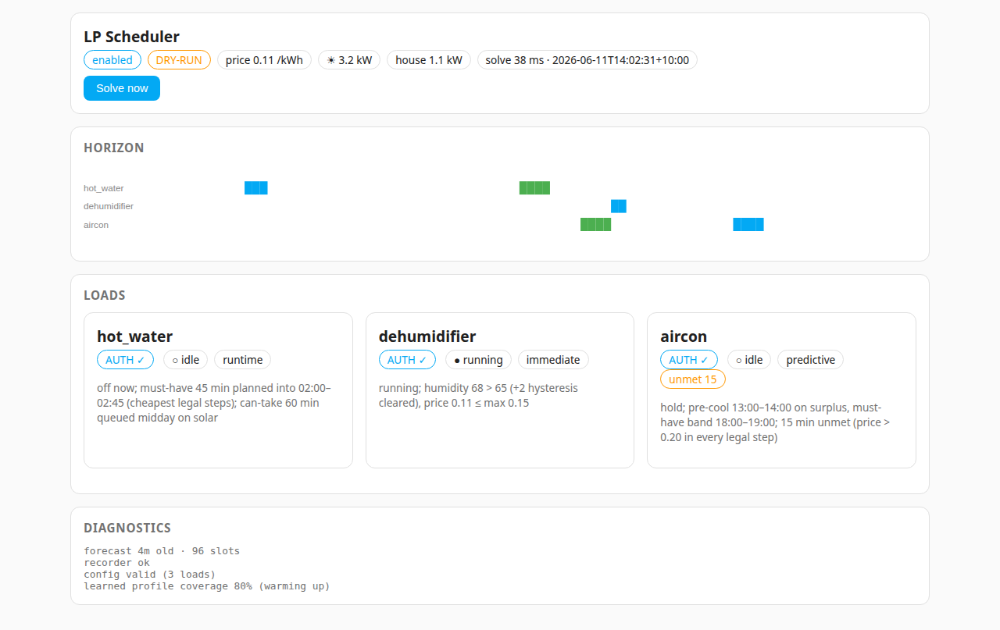
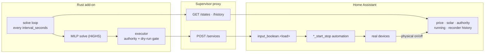
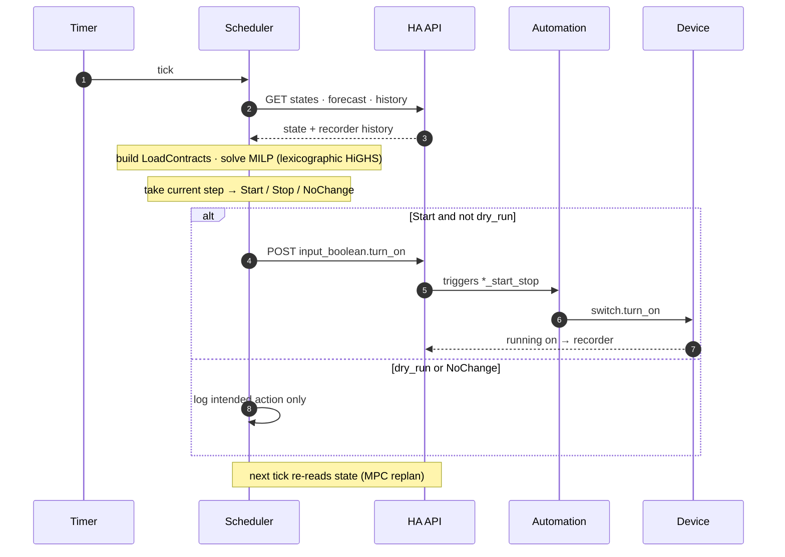
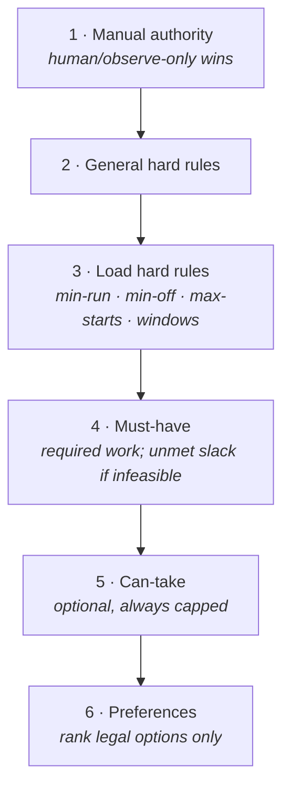

<div align="center">

# ⚡ Legit LP Scheduler

**A Linear-Program (MILP) home-load scheduler for Home Assistant.**

One optimiser. Every authorised load. Honest infeasibility.

[](https://github.com/nick-tgcs/legit-lp-for-ha/actions/workflows/validate.yml)
[](https://github.com/nick-tgcs/legit-lp-for-ha/releases)
[](https://github.com/rust-or/good_lp)
[](https://www.home-assistant.io/addons/)
[](LICENSE)

<picture>
  <source media="(prefers-color-scheme: dark)" srcset="docs/assets/panel-dark.png">
  
</picture>

<sub>The ingress panel — live solve status, the planned 24 h horizon, per-load decisions, and diagnostics. No login: it rides Home Assistant's own auth.</sub>

</div>

---

## What it is

Home Assistant owns your devices. **Legit LP Scheduler** decides *when* the
flexible ones should run — hot water, dehumidifier, air-con — by solving a
**mixed-integer linear program** over a 24 h horizon every cycle, executing only
the current step, and re-planning on the next tick (Model Predictive Control).

It reads your price forecast (Amber, Nordpool, Octopus… anything that publishes
slots), your solar production and house consumption, and each load's declared
*contract* — then it shifts runtime into the cheapest legal intervals, pulls
flexible load into your solar surplus, and **reports infeasibility honestly**
instead of quietly breaking a hard rule.

> It's a Home Assistant **add-on**: a single static Rust binary (HiGHS solver
> embedded), installed by adding this repository's URL to your add-on store. It
> ships in `dry_run: true` — it logs what it *would* do until you let it act.

### The gap it fills

The 2026 HA energy-optimisation ecosystem is rich (EMHASS, HAEO, Predbat, Solar
Optimizer) — but none models loads as **appliance-level contracts**:

- **per-load authority** — a boolean entity decides whether the scheduler may
  touch a load at all; manual control always wins, and it still *observes*
  loads it can't control;
- **absolute hard rules** as MILP *constraints* (min-run, min-off, max-starts,
  windows) — never penalties, never relaxed;
- **must-have vs can-take** demand with **per-demand price ceilings** — required
  work runs even when dear; optional work only when cheap or solar-backed;
- **honest infeasibility** — a too-tight situation surfaces as reported `unmet`
  slack, not a solver error and not a violated rule.

There is exactly **one** scheduler — the LP. A load's `planning` mode only
changes *how the LP models it* (`runtime` / `predictive` / `immediate`), never
*which engine* runs it. No fallback controller to mask bugs.

## Highlights

- 🧮 **Real MILP** via [`good_lp`](https://github.com/rust-or/good_lp) + the
  [HiGHS](https://highs.dev) solver — the same solver HAEO bundles.
- ☀️ **Solar-surplus aware** — a site power balance values load run inside
  surplus at *forgone feed-in*, so flexible work gravitates to the solar hump
  with no special-case rule.
- 🔌 **Device-agnostic** — loads register a data-only contract; the engine never
  knows a brand. Control is generic `domain.service` calls.
- 💱 **Provider-neutral pricing** — a published
  [JSON Schema](docs/schemas/price-forecast.schema.json) + declarative field-map;
  Amber is just the first mapping.
- 📊 **Native-feel ingress panel** — served by the same binary (axum + embedded
  assets, SSE live updates, server-rendered SVG horizon). No npm, no second
  service, light/dark for free.
- 🧪 **TDD throughout** — 94 unit/integration/e2e tests, real captured HA
  fixtures, plus a dockerised-HA staging harness. See [Testing](#testing--tdd).
- 🦀 **One static binary** — multi-arch (amd64 + aarch64), nothing to install
  inside HA.

## How it works

The scheduler never touches a device directly. It flips one `input_boolean`; an
existing decoupled HA automation actuates the real switch/climate; the device's
state lands in a `*_running` entity and HA's recorder; the next solve reads it
back. The control loop is closed *through* Home Assistant.



Every cycle: read global-enable + per-load authority + observations, build a
pure `WorldState` snapshot, solve the MILP, execute **only** the current step,
log the decision and reasons, publish the report to the panel.



### Strict precedence

Decisions obey one strict hierarchy. A lower tier **never** relaxes a higher
one — encoded as MILP constraints plus a two-stage lexicographic objective.



If must-have can't be met inside the legal space, the scheduler **reports**
`unmet` minutes — it does not violate a hard rule to meet demand.

See [ARCHITECTURE.md](ARCHITECTURE.md) for the full model and the
[planner design](docs/PLAN.md#planner--milp-via-good_lp--highs-the-v1-scheduler)
for the exact MILP formulation.

## Install

The add-on is distributed as a prebuilt multi-arch image on GHCR, referenced by
the manifest — so installing is just adding this repository:

1. **Settings → Add-ons → Add-on Store → ⋮ → Repositories**, add:
   ```
   https://github.com/nick-tgcs/legit-lp-for-ha
   ```
   <sub>Want the pre-release channel? Add
   `https://github.com/nick-tgcs/legit-lp-for-ha#develop` — Supervisor honours
   the `#branch` fragment.</sub>
2. Install **Legit LP Scheduler** and start it. It boots in **`dry_run: true`**
   and **self-seeds** its registry config to `/config/legit_lp.yaml` on first
   run, so you can watch its decisions before it ever acts.
3. Open the **LP Scheduler** entry in the sidebar to watch the panel.

Releases are cut by a CI pipeline that builds the image, promotes `develop` →
`main`, and tags — see [docs/RELEASING.md](docs/RELEASING.md).

## Configure

Two layers, mirroring the EMHASS add-on pattern:

- **Add-on options** (Supervisor UI) — operational knobs only:
  `interval_seconds`, `dry_run`, `time_zone`, `log_level`, an optional
  `hass_url` + `long_lived_token` (for running outside Supervisor), and
  `loads_config_path`.
- **Registry YAML** (`/config/legit_lp.yaml`) — the `global` block + per-load
  contracts. Declarative data only; no logic language. Full annotated example:
  [`addon/example.yaml`](addon/example.yaml).

A load contract in brief:

```yaml
loads:
  - id: hot_water
    type: hot_water
    planning: runtime                 # shift required runtime into the cheapest legal steps
    authority:
      enabled_entity: binary_sensor.hot_water_automated   # scheduler may act only when on
    control:
      start: { service: input_boolean.turn_on,  target: input_boolean.hot_water }
      stop:  { service: input_boolean.turn_off, target: input_boolean.hot_water }
    state:
      running_entity: binary_sensor.indoor_comfort_hot_water_running
    capability: { power_kw: 3.6 }
    hard_rules: { min_run_minutes: 20, min_off_minutes: 15, max_starts_per_day: 3 }
    must_have:                          # required regardless of price (no max_price)
      kind: runtime
      amount_hours: { entity: input_number.input_number_hot_water_runtime }   # live-tuned slider
      window: { start: "00:00", end: "06:30" }
    can_take:                           # optional boost, only when cheap/solar
      kind: runtime
      max_minutes: 60
      window: { start: "10:00", end: "16:00" }
      max_price: { value: 0.10 }
    preferences: { start_cost_aud: 0.02 }
```

Any numeric field can be a literal (`{ value: 0.10 }`) or a live entity
reference (`{ entity: input_number... }`), re-read every cycle — so your
existing dashboard sliders keep working unchanged.

## Testing & TDD

This repo is built **test-first** — red → green → refactor at every milestone,
real captured HA payloads as fixtures, the LP itself never mocked. Full
discipline and how to add tests: **[CONTRIBUTING.md](CONTRIBUTING.md)**.

| Layer | Lives in | Doubles | Count |
|---|---|---|---|
| **Unit** | `#[cfg(test)]` per module | none — pure functions | 60 |
| **Integration** | `scheduler/tests/*.rs` | mock `HaApi`; **real HiGHS** | 33 |
| **E2E** | `scheduler/tests/e2e.rs` | real binary + wiremock stub HA | 1 |
| **Staging** | `staging/` | dockerised **real** HA, fake hardware | scripted |

```bash
make test          # cargo fmt --check && clippy -D warnings && cargo test  (the CI gate)
```

Beyond the unit/integration/e2e gate there are two higher rungs against a *real*
Home Assistant in Docker — no risk to the house:

- **`staging/`** — boots `home-assistant:stable` with a seeded config that mirrors
  the live contract surface (authority templates, `*_start_stop` automations on
  fake switches, scriptable price/PV/consumption helpers). `scenario.sh` drives
  S1–S6 over the REST API.
- **`verify-release`** ([skill](.claude/skills/verify-release)) — pulls the
  *released* GHCR image and runs the full closed loop against a throwaway HA. The
  v0.1.0 release passed **16/16** live scenarios.

## Develop

```bash
# prerequisites: a Rust toolchain, plus cmake + a C++ compiler (HiGHS builds from source)
cd scheduler
cargo test                 # unit + integration + e2e
cargo run                  # run the binary locally (set SCHED_* env, see scheduler/src/main.rs)

# build the add-on image from the repo root (HiGHS compiles in the builder stage)
make build
```

The panel screenshots above regenerate deterministically from the real frontend
and a committed demo report — no live HA needed:

```bash
docs/assets/make_screenshots.sh   # needs python3 + the playwright CLI
```

### Project layout

```
addon/          HA add-on manifest, Dockerfile entrypoint, annotated example registry
scheduler/      the Rust crate
  src/          model · config · ha_client · forecast · profile · rules · lp · executor · status · web
  tests/        integration + e2e, with real captured fixtures/
staging/        dockerised real-HA harness (compose, seeded config, scenarios)
docs/           PLAN.md (design of record) · RELEASING.md · schemas/ · assets/
ARCHITECTURE.md the governing spec
```

## Further reading

- [ARCHITECTURE.md](ARCHITECTURE.md) — authority/rule model, demand types, the runtime pipeline, explicit prohibitions.
- [docs/PLAN.md](docs/PLAN.md) — the full design of record: MILP formulation, solar-surplus modelling, state strategy, failure modes, prior-art survey.
- [docs/RELEASING.md](docs/RELEASING.md) — branching & release pipeline.
- [docs/schemas/price-forecast.schema.json](docs/schemas/price-forecast.schema.json) — the provider-neutral pricing contract.
- [CONTRIBUTING.md](CONTRIBUTING.md) — TDD discipline, running the tests, the PR/release flow.

## License

[MIT](LICENSE).
