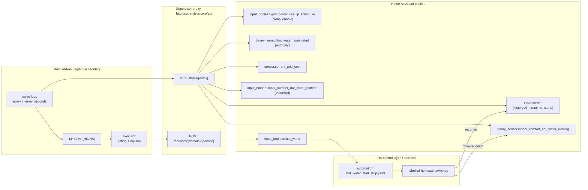
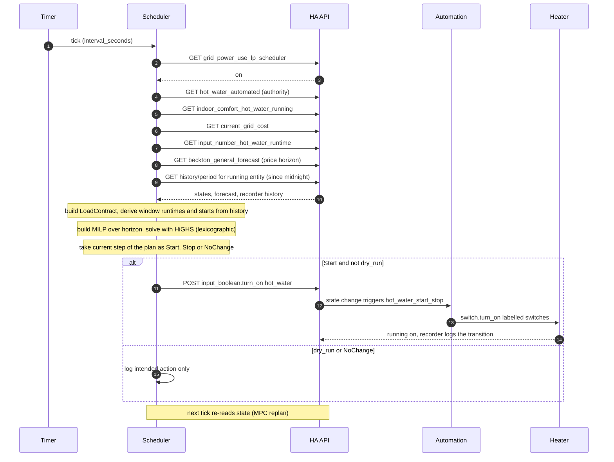
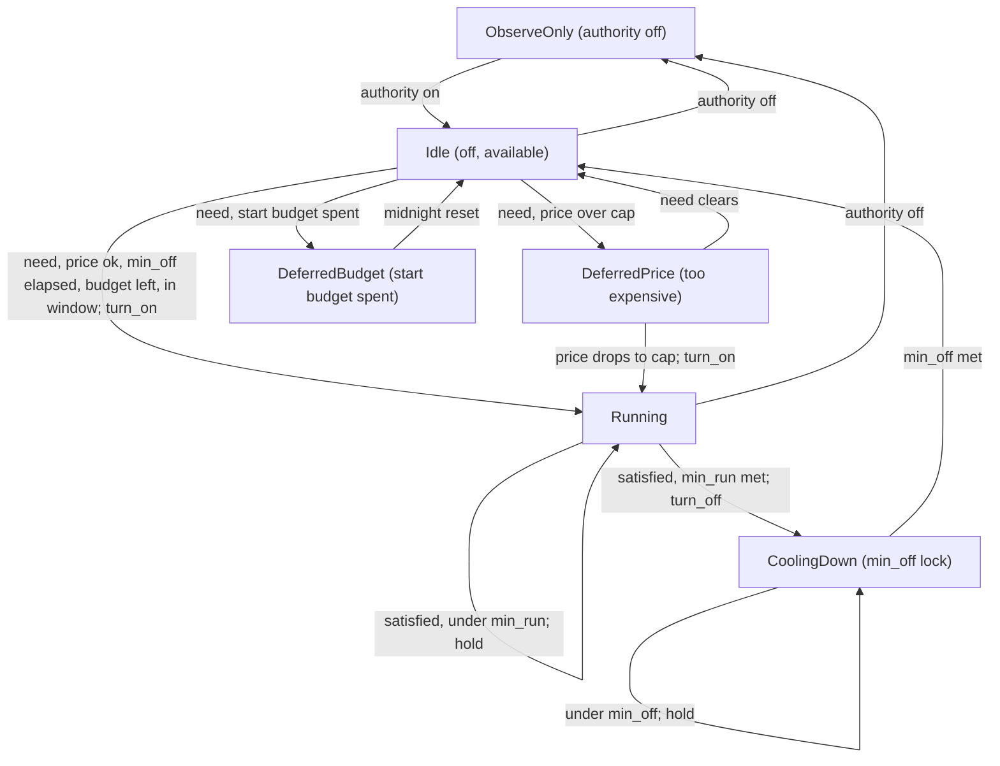
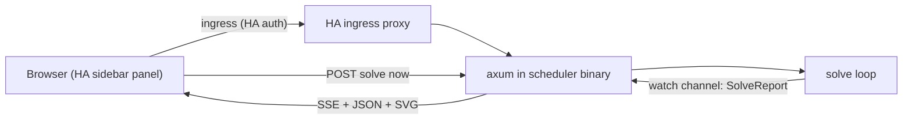

# Plan: Rust LP load scheduler — Home Assistant Add-on

Implementation plan for this repo. Iterate here before writing code; see
[ARCHITECTURE.md](../ARCHITECTURE.md) for the governing spec.

## Context

`vendor/legit-lp-for-ha` is a freshly-initialised git submodule
(`github.com/nick-tgcs/legit-lp-for-ha`) containing only `ARCHITECTURE.md`,
`README.md`, `LICENSE`, and a Rust-ready `.gitignore`. No code exists yet.

We are building the Rust implementation of that architecture: a Home Assistant
**Add-on** that runs an external Rust service. Home Assistant owns the real
devices and sensors; the Rust service reads state + the Amber price forecast,
solves a **Linear Program (MILP)** over a planning horizon, executes **only the
current timestep**, and re-solves next tick (Model Predictive Control). No
scheduling logic lives in HA automations.

**v1 is LP from day one** — the planner is a MILP built with
[`good_lp`](https://github.com/rust-or/good_lp) and solved by **HiGHS**
(`highs` crate). The strict precedence hierarchy (manual > hard rules > must-have
> can-take > preferences) is encoded as constraints + a lexicographic objective
(see "Planner — MILP"). **There is exactly one scheduler: the LP.** Every
authorised load goes through it; a load's `planning` mode only selects *how the LP
models it* (`runtime` / `predictive` / `immediate`), never *which engine* runs it.
There is no second planner and no fallback: must-have carries an `unmet` slack so
the model is always feasible (a too-tight situation is *reported*, not a solver
error), and if HiGHS ever genuinely errors the scheduler **logs and holds** (issues
no commands that cycle) rather than running a shadow controller that would mask the
bug.

### Decisions locked with the user

- **Device-agnostic engine.** The scheduler never knows device brands. Loads
  *register themselves* by declaring a data-only contract; the engine consumes
  contracts generically, dispatching only on `load_type`
  (`hot_water` | `dehumidifier` | `aircon`).
- **Provider-neutral pricing (Amber is just the first mapping).** The scheduler
  consumes a canonical price contract — current/feed-in price entities + a
  forecast attribute matching a **published JSON Schema**, with a declarative
  field-map for providers whose shape differs (see "Pricing contract"). No tariff
  classes, no provider names in code. Per-demand thresholds stay: each
  `must_have`/`can_take` declares its own `max_price` (literal or live
  `input_number` via `ValueRef`); a too-high price *defers* must-have, never makes
  it permanently illegal. Matches the existing `..._run_below_price_kwh` sliders.
- **Generic HA service calls** for control: a load declares any
  `domain.service` + target. Real mapping here = flip the decoupled
  `input_boolean.<load>` primitives (`input_boolean.turn_on`/`turn_off`) that
  `automations/.../*_start_stop.yaml` already act on.
- **Authority = existing composite sensors.** `binary_sensor.<load>_automated`
  (= `input_boolean.automate` AND `input_boolean.<load>_auto`) is the per-load
  authority entity; manual override already folds in via the master `automate`.
- **Real entities only.** Every entity id in this plan is verified present in
  `live_ha_config` (exceptions called out in "Open gaps").
- **Solar surplus is a v1 input.** The MILP carries a site power balance: live
  consumption (`sensor.current_sonnen_consumption`) + live PV
  (`sensor.current_sonnen_production`), learned half-hour consumption/PV-shape
  profiles (persisted in `/data`), Forecast.Solar day totals for scaling, and an
  import/export split priced at Amber import vs feed-in
  (`sensor.amber_electric_feedin`). Loads gravitate to surplus steps because the
  energy there costs feed-in, not import. See "Solar surplus & consumption
  forecasting".
- **v1 output = deterministic decision logs + the ingress web panel** (see "Web
  UI") + dry-run. Publishing a status *sensor entity* back to HA (for automations
  to consume) is still a documented later step ("Out of scope"), not in v1 — the
  panel is for humans, not a machine interface.

---

## Prior art — the 2026 HA energy-optimisation ecosystem (surveyed)

| Project | Form | Engine | Scope | Actuates? |
|---|---|---|---|---|
| [EMHASS](https://github.com/davidusb-geek/emhass) | add-on (Python) | LP (rewritten on CVXPY) | battery/PV-centric + "deferrable loads" (hours-in-window) | publishes sensors; HA automations act |
| [HAEO](https://github.com/hass-energy/haeo) | HACS integration (Python in HA) | **LP via bundled HiGHS** (`highspy`), tiered horizon | power-flow: battery, solar, grid, loads | **no** — recommendation sensors only |
| [Predbat](https://github.com/springfall2008/batpred) | AppDaemon app | heuristic plan search, 48 h horizon, 5-min replan | battery charge/discharge (inverter-centric) | yes, inverter commands |
| [Solar Optimizer](https://github.com/jmcollin78/solar_optimizer) | HACS integration | reactive surplus allocation + priorities | switch loads vs live PV surplus | yes, switches |
| PV Excess Control / AURUM | blueprints/HACS | threshold rules | surplus load switching | yes |

**What this validates in our design:** HiGHS is *the* solver in this space (HAEO
bundles it); MPC with frequent replanning is standard practice (Predbat replans
every 5 min over 48 h); and "HA owns devices, optimiser decides" is the consensus
split. We're on well-trodden ground for the hard parts.

**The gap nobody fills (why this add-on exists):** none of them has an
appliance-level *contract* — per-load authority, absolute hard rules
(min-run/min-off/max-starts as constraints, not penalties), must-have vs can-take
precedence with **per-demand price ceilings**, and honest infeasibility reporting.
EMHASS's deferrable loads are the closest and are still just hours-in-window;
HAEO won't actuate at all; Solar Optimizer is reactive-only (no price forecast,
no horizon). And none is a single static binary — they're all Python inside or
beside HA. The user already runs EMHASS (vendored fork) and this scheduler is its
deliberate replacement for *load* scheduling.

**Borrowed deliberately:** EMHASS's add-on packaging + `/data` write-through
patterns (already in this plan); HAEO's strict "delegate forecasting and price
fetching to HA, consume sensors" boundary (we read Amber sensors, we don't fetch);
Predbat's replan cadence as the sanity check for our 60 s tick / 15-min grid.

**Adopted into v1 after this survey:** **solar-surplus awareness** (Solar
Optimizer's core idea, done properly with a horizon): with PV + two Sonnens,
Amber import price alone doesn't see *local* surplus. v1 models the site power
balance — live consumption + PV, learned consumption/PV profiles, import/export
split at Amber import/feed-in prices — see "Solar surplus & consumption
forecasting". (Predbat-style consumption forecasting arrives with it, as the
learned profile.)

**Noted as future candidates (not v1):**
- **A custom Lovelace card** (Solar Optimizer ships one): would let the panel's
  load cards embed in normal dashboards alongside the ingress panel.
- **Battery modelling** (Predbat/EMHASS territory): the Sonnens stay unmodelled
  in v1 — surplus consumed by loads is valued at feed-in price (the conservative
  opportunity cost; in reality some surplus would charge the batteries instead).

---

## The load registration contract (data, not code)

Each load declares exactly these things (consumed generically by the engine):

1. **Identity** — stable `id`, `type` (`hot_water` | `dehumidifier` | `aircon`).
2. **Scheduler authority** — the HA boolean entity granting control. If `off`,
   the load is **observe-only**; manual/user control always wins.
3. **Control interface** — generic HA service calls for start and stop
   (`service: domain.svc`, `target: entity_id`, optional `data`). No brand logic.
4. **Observed state** — a `running` entity, plus a state sensor for setpoint loads
   (humidity for dehumidifier, temperature for aircon). Hot water needs no progress
   entity — its runtime-today is derived from the running entity's recorder history.
5. **Capability** — what the load can physically do, by type:
   hot water = fixed-runtime load; dehumidifier = humidity-reduction load;
   aircon = temperature-band load.
6. **Hard rules** — device-specific absolutes: `min_run_minutes`,
   `min_off_minutes`, `max_starts_per_day`, allowed `windows`, required sensor state.
7. **Must-have** — required work (e.g. hot water 90 min before 06:30; dehumidifier
   keep humidity < 65%; aircon keep temp within 19–25 °C in the occupied window).
8. **Can-take** — optional, **always capped**, never overrides hard rules/must-have
   (e.g. +60 min hot water in cheap periods; dry toward 55%; pre-heat/cool in band).
9. **Preferences** — soft ranking only (prefer cheap periods, prefer fewer starts);
   never makes an illegal action legal.

A load does **not**: embed YAML logic, dictate exact run times, override global
hard rules, or expose brand details.

---

## The exact load contract

The contract has **two faces** that must stay in lock-step:

- **Registration YAML** — what the user writes per load (declarative data).
- **`LoadContract` (Rust)** — the normalised, device-agnostic struct the
  **planner** (`LpPlanner`) consumes — it takes `&[LoadContract]` and nothing
  else. This is the solver boundary.

`config.rs` deserialises the YAML, resolves authority/state/observation entities
**and every `ValueRef`** (literal-or-entity numbers: `max_price`, `amount_hours`,
`max_percent`, `target_c`) via `ha_client` each cycle, and produces `LoadContract`
values with concrete `f64`s. Conversions live here: hot-water `amount_hours` ×60 →
`Runtime.minutes`, and `Runtime.completed_minutes` comes from the **derived**
`runtime_in_mh_window` (recorder history of the running entity intersected with the
current must-have window instance), not a config entity. For
aircon it derives `TemperatureBand { min: target−band, max: target+band }` from
`target_c`/`band_c`. The planner never sees an entity id, a brand, a `ValueRef`, or
a raw HA payload — only the resolved contract. The registry YAML is **re-read and
re-validated every cycle** (it's tiny), so edits take effect on the next solve —
and a broken edit keeps the last-good contracts active (see "Failure modes").

### 1. Registration YAML (exact shape — real entities from this repo)

All entity ids below exist in `live_ha_config` (verified). Control is by flipping
the decoupled `input_boolean.<load>` primitives that
`automations/.../*_start_stop.yaml` already act on. Authority uses the existing
composite `binary_sensor.<load>_automated` (= `input_boolean.automate` AND
`input_boolean.<load>_auto`). Price thresholds reference the live, dashboard-tuned
`input_number.*` entities.

```yaml
loads:
  # ---- hot water: fixed-runtime load -------------------------------------
  - id: hot_water
    type: hot_water
    planning: runtime          # shift required runtime into the cheapest legal steps
    authority:
      enabled_entity: binary_sensor.hot_water_automated   # automate AND hot_water_auto
    control:
      start: { service: input_boolean.turn_on,  target: input_boolean.hot_water }
      stop:  { service: input_boolean.turn_off, target: input_boolean.hot_water }
    state:
      running_entity: binary_sensor.indoor_comfort_hot_water_running
      # runtime-today and starts-today are DERIVED from this entity's recorder
      # history (see "State & runtime tracking") — no progress/count entity needed.
    capability:
      power_kw: 3.6
    hard_rules:
      min_run_minutes: 20
      min_off_minutes: 15
      max_starts_per_day: 3
      windows: []
    must_have:
      kind: runtime
      amount_hours: { entity: input_number.input_number_hot_water_runtime }  # live-tuned target
      window: { start: "00:00", end: "06:30" }
      # required regardless of price -> no max_price (runs even when expensive)
    can_take:
      kind: runtime
      max_minutes: 60
      window: { start: "10:00", end: "16:00" }
      max_price: { value: 0.10 }       # optional boost only when cheap/solar
    preferences: { start_cost_aud: 0.02 }   # per-start wear cost; tie-breaks toward fewer starts

  # ---- dehumidifier: setpoint-below load ---------------------------------
  - id: dehumidifier
    type: dehumidifier
    planning: immediate        # LP enforces the band at the current step only; no forward moisture model
    authority:
      enabled_entity: binary_sensor.dehumidifier_automated
    control:
      start: { service: input_boolean.turn_on,  target: input_boolean.dehumidifier }
      stop:  { service: input_boolean.turn_off, target: input_boolean.dehumidifier }
    state:
      running_entity:  binary_sensor.indoor_comfort_dehumidifiers_running
      progress_entity: sensor.humidity_average_inside          # observed %RH
    capability:
      power_kw: 0.3
      drop_per_hour: 8.0               # %RH removed per hour while running (MILP dynamics)
      drift_per_hour: 2.0              # passive %RH rise per hour while off
    hard_rules:
      min_run_minutes: 30
      min_off_minutes: 15
      windows: []
    must_have:
      kind: humidity_below
      max_percent: { entity: input_number.input_number_indoor_comfort_humidity_target_percent }
      start_hysteresis: { entity: input_number.input_number_indoor_comfort_humidity_start_hysteresis_percent }
        # needs-on above max+hysteresis, satisfied at <= max (kills band-edge chatter)
      max_price: { entity: input_number.input_number_indoor_comfort_dehumidifier_max_price_kwh }  # live, default 0.15
    can_take:
      kind: humidity_below
      target_percent: 55
      max_minutes: 120
      window: { start: "09:00", end: "17:00" }
      max_price: { value: 0.10 }       # dry further only when cheaper than the must-have ceiling
    preferences: { start_cost_aud: 0.01 }

  # ---- aircon: temperature-band load -------------------------------------
  - id: aircon
    type: aircon
    planning: predictive       # model thermal dynamics; pre-cool into cheap/solar steps
    authority:
      enabled_entity: binary_sensor.aircon_automated
    control:
      start: { service: input_boolean.turn_on,  target: input_boolean.aircon }
      stop:  { service: input_boolean.turn_off, target: input_boolean.aircon }
    state:
      running_entity:  climate.ac_0      # running = state != "off" (AirTouch4)
      progress_entity: sensor.temp_average_inside              # observed °C
    capability:
      power_kw: 2.5
      change_per_hour: 1.5             # °C moved toward target per hour while running (MILP dynamics)
      drift_per_hour: 1.0              # passive °C drift toward ambient while off
      ambient_entity: sensor.temp_outside   # sets the drift DIRECTION (toward ambient)
    hard_rules:
      min_run_minutes: 20
      min_off_minutes: 10
      windows: []
    must_have:
      kind: temperature_band
      target_c: { entity: input_number.input_number_climate_aircon_target_temp }
      band_c: 3                        # +/- around target -> [target-3, target+3]
      window: { start: "07:00", end: "22:00" }
      max_price: { entity: input_number.input_number_climate_aircon_run_below_price_kwh }  # "run below price"
    can_take:
      kind: temperature_band
      target_c: { entity: input_number.input_number_climate_aircon_target_temp }
      band_c: 1
      max_minutes: 90
      window: { start: "13:00", end: "16:00" }
      max_price: { value: 0.05 }       # pre-cool/heat only on very cheap/surplus
    preferences: { start_cost_aud: 0.05 }   # compressors hate cycling; price starts accordingly
```

Global block (provider-neutral `pricing:` contract — the *values* here are this
site's Amber entities; the *keys* never mention a provider):

```yaml
global:
  enabled_entity: input_boolean.grid_power_use_lp_scheduler  # NOTE: referenced by
    # existing dehumidify_house.yaml but NOT yet defined in input_booleans.yaml.
    # Must be added there (one-liner) when the add-on goes live. See "Open gaps".
  pricing:
    import_entity: sensor.current_grid_cost                 # currency/kWh, current step
    feedin_entity: sensor.amber_electric_feedin             # currency/kWh export value (optional)
    forecast:
      entity: sensor.beckton_general_forecast               # any entity carrying slot data
      attribute: forecasts                                  # which attribute holds the slots
      fields:                                               # provider field-map -> canonical schema
        start: start_time                                   # (omit `fields` entirely if the
        end: end_time                                       #  attribute is already canonical)
        import_per_kwh: per_kwh
  power:                                                     # site balance inputs (all W)
    consumption_entity: sensor.current_sonnen_consumption
    pv_entity:          sensor.current_sonnen_production
    pv_forecast:                                             # Forecast.Solar day totals scale the learned shape
      today_entity:    sensor.energy_production_today
      tomorrow_entity: sensor.energy_production_tomorrow
      now_entity:      sensor.power_production_now
    baseline_kw: 0.8        # consumption fallback until the learned profile warms up
  planning:
    grid_minutes: 15        # MILP step size; min_run/min_off rounded to this
    horizon_hours: 24       # plan this far ahead (capped at last deadline)
  hard_rules: []   # per-demand max_price covers price gating; add site-wide rules here if needed
```

### Pricing contract — provider-neutral, published as JSON Schema

The engine never knows a provider's name. It consumes three things, all via HA
entities (the HAEO boundary: providers' integrations populate entities; we read
entities):

1. **`import_entity`** — numeric state, *currency per kWh* (whatever currency the
   site uses, used consistently; sign convention: positive = you pay).
2. **`feedin_entity`** *(optional)* — numeric state, currency per kWh you're paid
   to export. Absent → surplus is valued at 0.
3. **`forecast`** — an entity attribute containing an array of **canonical
   forecast slots**, defined by a JSON Schema shipped at
   `docs/schemas/price-forecast.schema.json`:

```json
{
  "$schema": "https://json-schema.org/draft/2020-12/schema",
  "$id": "https://raw.githubusercontent.com/nick-tgcs/legit-lp-for-ha/main/docs/schemas/price-forecast.schema.json",
  "title": "Price forecast slots",
  "description": "Time-ordered price slots. Any slot duration; gaps allowed (flat-filled). Timestamps RFC3339 with offset. Prices in the site currency per kWh.",
  "type": "array",
  "items": {
    "type": "object",
    "required": ["start", "end", "import_per_kwh"],
    "properties": {
      "start":          { "type": "string", "format": "date-time" },
      "end":            { "type": "string", "format": "date-time" },
      "import_per_kwh": { "type": "number" },
      "export_per_kwh": { "type": "number" }
    },
    "additionalProperties": true
  }
}
```

**Getting a provider's data into that shape — two declarative routes, no code:**

- **Field-map** (`pricing.forecast.fields`): rename flat fields at parse time.
  Amber is exactly this: `{start: start_time, end: end_time, import_per_kwh:
  per_kwh}`. Nordpool/Tibber/Octopus integrations with flat per-slot attributes
  map the same way.
- **Template sensor**: for providers whose attribute isn't a flat array of slots,
  a small HA template sensor reshapes it into the canonical form (documented with
  an example in the add-on README). The scheduler then needs no `fields` at all.

Rules the parser enforces (provider-agnostically): slots sorted by `start`,
`end > start`, overlaps rejected (logged, forecast treated as absent rather than
guessed), gaps flat-filled, `export_per_kwh` used per-slot when present (else
`feedin_entity`, else 0). The schema file is the contract of record: CI validates
every checked-in forecast fixture against it, and `forecast.rs`'s serde types are
kept structurally identical to it.

### Price thresholds & live-tuned numbers (`ValueRef`)

Per the requirement that loads define their own "run below" price, any numeric
field that maps to a dashboard input can be a **literal** or an **entity
reference**, read fresh each cycle:

```yaml
max_price: { value: 0.15 }                                   # literal AUD/kWh
max_price: { entity: input_number.input_number_climate_aircon_run_below_price_kwh }  # live
```

`max_price` lives on **each demand** (`must_have` and `can_take`), not on the
load — required work may tolerate a higher price than optional work. `ValueRef` is
used for those `max_price`s and for live demand targets (`amount_hours`,
`max_percent`, `target_c`) so the existing dashboard sliders keep working
unchanged. `config.rs` resolves entity-backed `ValueRef`s via `ha_client` each
cycle; unresolved/unavailable → that target is treated as **absent** (logged),
never as zero. A demand with no `max_price` runs regardless of price.

### Planning mode (`planning:`, per load — the load decides how it's solved)

Each load declares how the planner should treat it. This is the load's call, not a
global switch, because predictability is a property of the device:

All three modes are solved by the **same LP** — `planning` only changes how that
load is *modelled inside* the MILP, never which engine runs it.

| `planning` | For | How the LP models it | Needs |
|---|---|---|---|
| `runtime` | hot water (runtime loads) | shifts the required `minutes` into the cheapest legal steps before the deadline (min-run/min-off/max-starts honoured). | nothing extra |
| `predictive` | a setpoint load whose dynamics are knowable | adds the `level[t]` trajectory (`rate_on`/`drift`) + band over the horizon → can **pre-condition** (e.g. pre-cool into cheap/solar steps). | `*_per_hour` + `drift_per_hour` |
| `immediate` | a setpoint load whose dynamics are noisy/not worth modelling | constrains the band **only at the current step** from the observed value (no forward trajectory); future steps stay free for cost-optimised can-take. | only the band + `max_price` |

`config.rs` validates the combination: `runtime` requires a `runtime` demand;
`predictive` requires `*_per_hour`+`drift_per_hour`; `immediate` ignores those
rates (they may be omitted). Every authorised load — whatever its mode — enters the
one MILP; if a shared site-power constraint is added later, all of them participate
automatically.

### 2. `LoadContract` (Rust — the solver boundary)

```rust
pub struct LoadContract {
    pub id: LoadId,
    pub load_type: LoadType,            // HotWater | Dehumidifier | Aircon
    pub planning: Planning,            // Runtime | Predictive | Immediate (selects in-LP modelling)
    pub power_kw: f64,                  // rated draw: site limits + cost objective
    pub authority: bool,               // resolved from authority.enabled_entity
    pub hard: HardRules,
    pub must_have: Demand,
    pub can_take: Option<Demand>,       // always carries a cap
    pub prefs: Preferences,
    pub obs: Observation,              // resolved HA observations
    pub control: Control,              // start/stop ServiceCall (executor only)
}

pub enum Planning {                  // how the LP models this load (one engine; not a routing choice)
    Runtime,                          // shift required runtime across the horizon (hot water)
    Predictive,                       // model setpoint dynamics in the MILP (pre-condition)
    Immediate,                        // band constrained at the current step only, no forward model
}

pub struct HardRules {
    pub min_run: Duration,
    pub min_off: Duration,
    pub max_starts_per_day: Option<u32>,
    pub windows: Vec<Window>,          // empty = always allowed
}

/// A demand = what work + the price ceiling it will run below.
pub struct Demand {
    pub kind: DemandKind,
    pub max_price: Option<f64>,        // run only when price_now <= this; None = any price
}

/// One enum covers all three load types — the planner branches on data, not brand.
pub enum DemandKind {
    /// hot_water — accumulate runtime within a window.
    Runtime  { minutes: u32, window: Window, completed_minutes: u32 },
    /// dehumidifier — keep observed %RH at/below `max`.
    /// `drop_per_hour`/`drift_per_hour` drive the trajectory for `predictive`;
    /// `immediate` mode uses only `max`/`observed`/`start_hysteresis` (current-step
    /// band: needs-on above max+hysteresis, satisfied at <= max). `cap_minutes` caps can-take.
    HumidityBelow { max: f64, observed: Option<f64>, start_hysteresis: f64,
                    drop_per_hour: f64, drift_per_hour: f64,
                    window: Option<Window>, cap_minutes: Option<u32> },
    /// aircon — keep observed °C within [min,max].
    /// `change_per_hour`/`drift_per_hour` drive the trajectory for `predictive`
    /// (`ambient` = resolved ambient_entity reading; sets drift direction);
    /// `immediate` mode uses only the band/`observed`. `cap_minutes` caps can-take.
    TemperatureBand { min: f64, max: f64, observed: Option<f64>,
                      change_per_hour: f64, drift_per_hour: f64, ambient: Option<f64>,
                      window: Window, cap_minutes: Option<u32> },
}

pub struct Preferences { pub start_cost_aud: f64 }  // per-start wear cost, same units as energy.
// ("prefer cheap" needs no weight — the cost objective already does it; a
//  cheap_price_weight would be a dead knob.)

pub struct Observation {            // all DERIVED from HA each cycle (recorder history)
    pub running: Option<bool>,         // None = unknown/unavailable -> observe-only
    pub starts_today: u32,             // off->on transitions since local midnight
    pub runtime_in_mh_window: Duration, // on-time inside the CURRENT must-have window instance
    pub runtime_in_ct_window: Duration, // on-time inside the current can-take window (cap usage)
    pub current_stretch: Duration,     // length of the current on/off stretch (min_run/min_off)
}
// One history query per load; the fold helper intersects the on-spans with each
// window. Raw runtime-today falls out of the same fold for logging.
```

The planner takes only the contract plus a pure world snapshot:

```rust
pub struct WorldState {
    pub now: DateTime<Tz>,
    pub global_enabled: bool,
    pub price_now: Option<f64>,        // sensor.current_grid_cost, AUD/kWh (current step)
    pub price_forecast: Vec<(DateTime<Tz>, f64)>,  // Amber import forecast, resampled onto the grid
    pub feedin: Vec<f64>,              // AUD/kWh export value per step (flat current if no forecast)
    pub pv: Vec<f64>,                  // kW per step: learned shape scaled to Forecast.Solar day totals
    pub baseload: Vec<f64>,            // kW per step: learned consumption profile minus managed loads
    // current step of pv/baseload is overridden by the live sensor readings
}

// One planner. (A `Planner` trait is optional — kept only if a mock helps testing.)
impl LpPlanner {
    pub fn plan(&self, world: &WorldState, loads: &[LoadContract]) -> Vec<Decision>;
}
```

### 3. How the LP uses each contract field

| Field | Used by the MILP as |
|---|---|
| `hard`, `authority`, `obs` | per-step constraints over the horizon (current state warm-starts step 0) |
| `must_have.observed` / `completed_minutes` | initial state of the horizon |
| `*_per_hour`, `cap_minutes` | trajectory (effect-rate) constraints + can-take caps |
| `demand.max_price` | per-step on/off bound (`x=0` where `price[t] > max_price`) |
| `price_now`, `price_forecast` | the price series the objective minimises over |
| `power_kw`, `prefs.start_cost_aud` | objective coefficients (energy cost + per-start cost) |

Hard rules → constraints; per-demand `max_price` → per-step bounds; preferences →
objective coefficients; must-have that can't be met inside the legal space →
`unmet` slack, reported, never relaxed by touching a hard rule.

---

## Strict precedence (enforced in this order; hard rules never relaxed)

1. Manual authority → 2. General hard rules → 3. Load hard rules →
4. Must-have → 5. Can-take (capped) → 6. Preferences (rank legal options only).

If must-have can't be met inside the legal space, **report infeasible/partial** —
never relax a hard rule.

---

## Repository layout (inside the submodule)

```
addon/
  config.yaml        # HA add-on manifest + options schema
  Dockerfile         # multi-stage: build Rust, copy binary into final image
  run.sh             # bashio entrypoint: read options, exec the binary
  README.md          # install / config / run
  example.yaml       # example load-contract config (the registry the user edits)
scheduler/
  Cargo.toml
  src/
    main.rs          # wiring + scheduler loop; anyhow boundary
    config.rs        # load + validate addon options.json AND loads YAML (serde)
    ha_client.rs     # ALL HA REST I/O; safe unknown/unavailable parsing
    model.rs         # Load, LoadType, contract structs, WorldState, Decision
    rules.rs         # hard-rule -> constraint helpers (min_run/min_off/max_starts/windows)
    lp.rs            # the planner: good_lp MILP build + lexicographic HiGHS solve
    forecast.rs      # canonical-schema slots (+ field-map) -> price[]/feedin[] on the grid
    profile.rs       # learned half-hour EWMA profiles (baseload + PV shape), /data/profile.json
    executor.rs      # authority/global/dry-run gating; calls ha_client
    status.rs        # structured decision logging + SolveReport (UI's data model)
    web.rs           # axum ingress panel: SSE, JSON API, horizon SVG renderer
    time.rs          # tz-aware now, window membership, local-midnight boundary
    error.rs         # thiserror SchedulerError (no anyhow in core)
  assets/            # embedded UI: index.html, app.css, app.js (vanilla ES module)
  tests/
    rule_precedence.rs # integration: precedence on the LP's current-step output
    lp.rs              # integration: horizon/cost behaviour of the MILP
    cycle.rs           # integration: one full solve cycle over mock HaApi
    web.rs             # integration: panel API against a canned watch channel
    e2e.rs             # e2e: real binary vs wiremock stub HA
    fixtures/          # REAL captured HA payloads (forecast, history, states)
staging/
  docker-compose.yaml  # disposable real HA Core for pre-live testing
  ha_config/           # seeded test config: same contract surface, fake hardware
  bootstrap.sh         # onboard + mint long-lived token -> staging/.token
  scenario.sh          # drive S1-S5 over the REST API (prices, authority)
repository.yaml      # HA add-on repository manifest (install via custom repo URL)
docs/
  PLAN.md            # this plan
  schemas/
    price-forecast.schema.json   # the provider-neutral pricing contract of record
README.md            # repo-level pointer (exists)
ARCHITECTURE.md      # spec (exists, unchanged)
```

**Build/packaging note:** mirror the existing `vendor/emhass-add-on` pattern —
`addon/config.yaml` references a prebuilt multi-arch image
(`image: ghcr.io/nick-tgcs/legit-lp-for-ha`) published by the `Dockerfile`
(build context = repo root so it can reach `scheduler/`). This avoids the local
add-on build-context limitation (a Dockerfile can't `COPY` a sibling of its own
folder). CI/GHCR publish wiring is out of scope for the first cut; the Dockerfile
will be correct and locally buildable from the repo root.

---

## Module responsibilities

### model.rs — the device-agnostic core
Defines the **exact load contract** (see "The exact load contract" above):
`LoadContract`, `LoadType`, `Planning`, `HardRules`, `Demand`/`DemandKind`,
`Preferences`, `Observation`, `Control`
(`ServiceCall { domain, service, target_entity, data: serde_json::Value }`),
`WorldState`, and `Decision { load_id, action: Action, reason }` with
`Action { Start, Stop, NoChange }`. `WorldState` is a **pure snapshot** (no I/O),
built by `main` from `ha_client` reads so the planner is testable in isolation.

### ha_client.rs — isolate ALL HA I/O
- Talks to Supervisor proxy `http://supervisor/core/api` using `SUPERVISOR_TOKEN`
  (env), with optional `hass_url` + long-lived token override (EMHASS pattern).
- `get_state(entity) -> Result<HaState>`; `call_service(domain, service, target, data)`.
- `get_history(entity, since) -> Result<Vec<StateSpan>>` — `GET /history/period/
  {since}?filter_entity_id={entity}&minimal_response&end_time={now}`. A small helper
  folds the returned state list into `{ on_seconds, starts, current_stretch }` over
  any `[start,end]`; intersecting with window instances yields `runtime_in_mh_window`,
  `runtime_in_ct_window`, `starts_today`,
  and current on/off duration (see "State & runtime tracking"). The
  "on" predicate is per load (binary `on`, or `climate.ac_0` state ≠ `off`).
- Safe parsing: `unknown` / `unavailable` / `none` / `""` → `None`, never panic;
  bad JSON / empty history → typed error or absent accumulator, logged clearly.
- Behind a `HaApi` trait (incl. `get_history`) so tests inject a recording mock.

### rules.rs — hard rules → MILP constraint helpers (pure)
Pure functions that translate a load's hard rules into the masks/constraints `lp.rs`
adds to the model:
- per-step **window mask** (`x[t]=0` outside allowed `windows`) and **price-gate
  mask** (`x[t]=0` where `price[t] > demand.max_price`).
- **min-run / min-off** emitters (min up/down-time constraints), seeded with the
  observed `current_stretch` so the lock that's already in progress is respected.
- **max-starts** row (`Σ start[t] + starts_today <= max_starts`).
- General/site-wide hard rules (optional; default none) — e.g. a future total-power
  cap evaluated across loads.
Price is **not** a current-step gate here — it's a per-step bound in the objective's
feasible set, so a too-high price *defers* required work over the horizon (or shows
as `unmet`) rather than being a hard illegal.

### planner.rs / lp.rs — the one planner (MILP)
- `LpPlanner::plan(&WorldState, &[LoadContract]) -> Vec<Decision>` builds and solves
  the MILP per "Planner — MILP" and returns the current-step decision per load. The
  good_lp model construction + lexicographic solve loop live in `lp.rs`.
- It consumes only `&[LoadContract]` + `WorldState`; `ha_client`/`executor` don't
  depend on it.
- On a HiGHS error (should not happen — see "Planner — MILP"), it returns
  `NoChange` for every load with an error reason; main logs it loudly. No second
  planner exists.

### executor.rs — gating + action
- Refuses to act unless: global scheduler enabled AND per-load authority on
  (re-checked here even though the planner already excluded such loads — defence in
  depth; legality of the action itself is the LP's guarantee via its constraints).
  In **dry-run**, logs the intended `ServiceCall` but makes no HA call.
- Calls `ha_client.call_service` for `Start`/`Stop` only.

### status.rs — deterministic logs + `SolveReport`
Builds one `SolveReport` per cycle — the single source for both the log lines and
the web UI: timestamp, solver outcome + duration, prices (now + horizon), and per
load: authority, running, planned horizon blocks, decision + reason, budgets
(runtime/starts used vs caps), `unmet`, diagnostics (forecast age, recorder ok,
config validation). A bounded ring buffer (last ~200 decisions) backs the UI's
decision log. Per-load log lines cover id, type, authority, running, start/stop
reason, blocking hard rule, infeasible/partial must-have, can-take utilisation, e.g.:
```
hot_water: observe-only; authority off (binary_sensor.hot_water_automated)
hot_water: off now; must-have 45min planned into 02:00-02:45 (cheapest legal steps)
hot_water: start; must-have 30min remaining, window closes 06:30
dehumidifier: start; humidity 68 > 65 (+2 hysteresis cleared), price 0.11 <= max 0.15
aircon: hold; band breach but price 0.42 > must-have max 0.20 in every legal step; unmet 15min
aircon: stop; inside band, no can-take step below 0.05 now
aircon: infeasible; must-have unmet 30min (min_off + window leave no legal steps)
```

### profile.rs — learned profiles (see "Solar surplus & consumption forecasting")
- Per-tick sampling of consumption (corrected to baseload) and PV; 48 half-hour
  EWMA buckets (consumption: weekday/weekend sets; PV: one set).
- Builds `WorldState.baseload[]`/`pv[]` for the horizon (PV rescaled to
  Forecast.Solar day totals; current step overridden by live readings).
- Write-through persistence to `/data/profile.json`; cold-start → `baseline_kw` /
  zero-PV fallback, coverage surfaced in panel diagnostics.

### web.rs — the ingress panel (see "Web UI")
- axum router: embedded static assets (`rust-embed`), `GET ./api/status`,
  `GET ./api/events` (SSE), `GET ./horizon.svg`, `POST ./api/solve`, and
  `GET /health` (200 while the solve loop is live — the Supervisor watchdog target).
- Reads the latest `SolveReport` from a `tokio::sync::watch` receiver; the solve
  loop is the only writer. `POST ./api/solve` nudges the loop via a notify channel.
- All paths relative (ingress prefix); binds `0.0.0.0:8099` (reachable only via
  the Supervisor's ingress network — no host port is mapped).

### time.rs / error.rs
- `time.rs`: tz from addon options; `now` is **injected** (passed down from `main`,
  never read inside core modules — that's what makes the whole pipeline testable
  with fixed clocks); `in_window("00:00","06:30")` with overnight handling, and the
  local-midnight boundary used for since-midnight history queries, the MILP grid
  origin, and the `DeferredBudget` reset.
- `error.rs`: `thiserror`-based `SchedulerError`; `anyhow` only in `main.rs`.

### main.rs — the loop + web server
Load config → build `HaClient` → spawn the axum server (`web.rs`) → every
`interval_seconds` (or on a Solve-now nudge): read global-enabled + all
observations → build `WorldState` → `planner.plan` → `executor.execute` →
`status` log → publish the `SolveReport` into the watch channel (UI updates via
SSE). Replan fully each cycle (MPC; no future automations pushed).

---

## Demand semantics — what "needs to run" means per `DemandKind`

The LP needs a precise definition of *when a demand is satisfied*, to write its
must-have constraints and (for `immediate` loads) the current-step band. These are
state-only predicates over the observed value; price/legality are handled
separately by the LP (price gate + hard-rule constraints + lexicographic order).
Precedence itself (manual > hard rules > must-have > can-take > preferences) is
implemented by the LP's constraints + lexicographic objective — see "Planner — MILP".

- **`Runtime { minutes, window, completed_minutes }`** — `remaining =
  minutes.saturating_sub(completed_minutes)`. Satisfied when `remaining == 0` or
  outside the window. The LP must accumulate `remaining` on-minutes inside the
  window (with `unmet` slack if it can't fit).
- **`HumidityBelow { max, observed, start_hysteresis, .. }`** — `observed == None`
  (sensor unknown) → no command (observe-only). Needs running once
  `observed > max + start_hysteresis`; satisfied at/below `max` (asymmetric
  trigger/clear kills band-edge chatter; hysteresis defaults to 0).
- **`TemperatureBand { min, max, observed, window, .. }`** — `observed == None`
  → no command. In-window needs running while `observed` is outside `[min,max]`;
  satisfied inside the band; outside the window, indifferent.

Can-take uses the same predicates against the tighter target (`target_percent` /
inner band), bounded by `cap_minutes` of in-window runtime, and is only scheduled
where `price <= can_take.max_price`.

How each `planning` mode turns these into LP constraints:
- `runtime` → horizon runtime-accumulation constraint.
- `predictive` → `level[t]` trajectory + band over the whole window.
- `immediate` → band enforced **only at the current step** from `observed` (no
  trajectory); future steps free for cost-optimised can-take.

Unknown price: must-have ignores a missing `price_now` (never blocks required
work); can-take requires a known `price <= max_price`.

---

## State & runtime tracking — what scheduling must remember, and where it lives

Scheduling **is** stateful: min-run/min-off locks, runtime-accumulated-toward-a-
target, daily start budgets, and (later) learned device behaviour are all *memory*.
So the real question is not "stateless vs stateful" — it's **where each piece of
state lives** so we neither (a) bloat HA with dozens of helper entities per load,
nor (b) keep a private ledger that silently drifts from reality the moment a human
operates the device (which authority explicitly permits).

### The state scheduling actually needs

| State | Used by | Changes when |
|---|---|---|
| running now | everything | device toggles |
| current run / off duration | `min_run`, `min_off` | device toggles |
| runtime accumulated today | hot-water `must_have` runtime, reporting | device runs |
| runtime in a can-take window | can-take `cap_minutes` | device runs in window |
| starts today | `max_starts_per_day` | device turns on |
| observed humidity / temperature | setpoint demands | sensor updates |
| (future) learned drop-/°C-per-hour, power | LP effect model | calibration |
| (future) cost today | reporting | device runs |

### Why both extremes are wrong (the dichotomy you named)

- **Put it all in HA entities** (`history_stats` + `input_number` per metric/window/
  load): restart-proof and dashboard-visible, but it's an *entity explosion*
  (runtime-today, starts-today, every can-take window, cost… ×3 loads = dozens of
  templated helpers) and it still **cannot** express some scheduling state, e.g.
  attributing runtime to a specific demand. This is the "fuck-load of entities"
  path — rejected.
- **Put it all in a private scheduler ledger** built from the scheduler's own
  commands: clean and expressive, but it **drifts** as soon as someone runs the
  device by hand — `starts_today`/`runtime_today` go wrong and hard rules misfire.
  Rejected as the *source of truth*.

### The design: scheduler owns the working state, HA's recorder is ground truth

The fact that breaks the dichotomy: **HA's recorder already logs every state change
of the existing `*_running` entity, including manual operation.** So the scheduler
needs *no* helper entity per metric and *no* drift-prone private log — it
**derives** every accumulator from that one entity via the **history API**
(`GET /api/history/period`, available through `homeassistant_api: true`):

- `runtime_in_mh_window` = Σ time the running entity was `on`, intersected with the
  current must-have window instance (feeds `Runtime.completed_minutes`).
- `runtime_in_ct_window` = same, intersected with the can-take window (`cap_minutes` usage).
- `starts_today` = count of `off→on` transitions over `[local_midnight, now]`.
- `current run / off duration` = length of the *current* on/off stretch. For a
  binary sensor this equals `now − last_changed`; for `climate.ac_0` it must come
  from history (mode changes like `auto→cool` reset `last_changed` without the unit
  ever stopping), so we find the last `off→non-off` transition. This is why we
  derive from history rather than trusting `last_changed` blindly.

Per load that is **one history query on one already-existing entity per cycle** — a
binary sensor toggles only a handful of times a day, so the payload is tiny. It is
exact (catches sub-interval toggles a state-only read would miss), it **includes
manual operation** (no drift), and it survives add-on restarts with nothing to
persist (recomputed from HA).

**So the scheduler is genuinely stateful** — it computes and reasons about runtimes
and start budgets every cycle, which is the core of scheduling — but its durable
state is limited to **derived knowledge** (the learned consumption/PV profiles in
`/data/profile.json` — see "Solar surplus"): every ground-truth accumulator lives
in HA's recorder and is recomputed each cycle, held in memory only for the solve.

### What this changes vs the earlier draft

- **No new HA helper entities.** The previously-proposed `..._on_time_today` /
  `..._starts_today` `history_stats` sensors are **dropped as a requirement** (the
  existing hot-water ones may stay for dashboards, but the scheduler computes its
  own from the running entity). Per load the scheduler needs only what already
  exists: the running entity, the authority entity, and the humidity/temperature
  sensor. The contract's `state` block therefore drops `starts_today_entity` /
  `runtime_today_entity` — these are derived, not configured.
- **Persistence is reserved for derived knowledge only.** `/data` holds the
  options HA writes plus `/data/profile.json` (the learned consumption/PV
  profiles — see "Solar surplus"). Ground-truth accumulators stay recorder-derived
  with zero persistence.
- **A `/data` store appears only where HA genuinely can't be the source** — the
  future *calibration* of the LP effect coefficients (learned drop-per-hour, measured
  power) and a cost ledger are scheduler-owned by nature; they live in `/data` (seeded/validated against HA
  where possible), never as a swarm of HA entities.
- **Degrade safely:** if the history API is unavailable or the recorder has no data
  for an entity, that one accumulator is treated as absent and logged; the affected
  hard rule is skipped rather than guessed.

### Start-budget management (the "loads manage that" resolution)

`max_starts_per_day` is a **total** ceiling on the device's on-transitions, derived
from the history query above — it bounds manual + scheduler starts together,
because the limit protects hardware (compressor short-cycling) and the hardware
doesn't care who started it. When the count hits the ceiling the load sits in
`DeferredBudget` and the scheduler issues no further Start until the local-midnight
reset (`aircon: defer; starts_today 3 >= max 3`). Bounding *only* scheduler starts
would require a private daily tally (durable `/data` state) — documented as the
alternative; total-ceiling is the recommended default.

### Decision: A (recorder-derived each cycle). Full option space + why A wins here

The accumulators in question: `runtime_in_mh_window` (must-have progress),
`runtime_in_ct_window` (can-take cap), `starts_today` (start budget),
`current_stretch` (min_run/min_off). Four distinct
mechanisms; they differ in *who computes*, *where it's stored*, and *what happens
on add-on restart / on manual operation*.

**A — Recorder-derived, no persistence.**
Each cycle the scheduler calls `get_history(running_entity, since=midnight)` and
folds the state list into the accumulators in code.
- Store: nothing (recomputed each cycle). Compute: scheduler. Restart: irrelevant
  (recomputed). Manual ops: captured (recorder logs them).
- Cost: 1 small history call per load per cycle (a binary sensor has a few rows/day).
- Needs: recorder enabled (default) and retaining "today" (default 10 days).
- Failure: history API down → that accumulator absent → its hard rule skipped + logged.

**B — Recorder-seeded, persisted incremental ledger.**
Seed accumulators from `get_history` at boot and at each local midnight; in between,
update incrementally each cycle from the live running state, and persist to
`/data/ledger.json`.
- Store: `/data`. Compute: scheduler. Restart: re-seed from history (safe). Manual
  ops: captured at seed time; a manual toggle *between* seeds is caught next midnight
  (or add a periodic re-seed).
- Cost: ~2 history calls/day/load; otherwise local. Fast steady-state.
- Risk: incremental logic can miss a sub-interval toggle until the next re-seed;
  more code + reconciliation.

**C — HA `history_stats` helper entities (HA computes, scheduler reads).**
Define `history_stats` sensors per load/metric/window in `live_ha_config`; the
scheduler just reads their numeric state like any other entity.
- Store: HA (recorder-backed). Compute: HA. Restart: irrelevant. Manual ops: captured.
- Cost: trivial scheduler code; **but** many helper entities (time-today + count-today
  per load, plus a templated `history_stats` per can-take window) and YAML upkeep.
- Limit: can't attribute runtime to a specific demand; window sensors are fiddly.
  This is the entity-explosion path.

**D — HA helper entities the scheduler WRITES (`input_number`/`input_datetime`).**
Scheduler computes the values and writes them back to HA helpers each cycle via
service calls; reads them back as its store.
- Store: HA (scheduler-owned values). Compute: scheduler. Restart: values persist in
  HA. Manual ops: **NOT** captured unless reconciled (the helper only reflects what
  the scheduler wrote) → drift, same flaw as a private command-log.
- Upside: values visible on dashboards without extra read code.
- Downside: write-back service calls every cycle; double source of truth.

**Cross-cutting principle (applies under any of A–D): split state by class.**
Physical truth that *must* include manual operation (runtime/starts/stretch) should
come from the recorder (A/B/C), never from a write-back log (D) or a private
command tally. State HA *cannot* represent — per-demand attribution, MPC
commitments, future calibration of the LP effect coefficients, a cost ledger — is
scheduler-owned and belongs in `/data`, regardless of which of A–D handles the
accumulators. In v1 that scheduler-owned set contains exactly one thing: the
learned consumption/PV profiles (`/data/profile.json` — "Solar surplus"). The
accumulators themselves stay recorder-derivable (can-take cap is total-window
runtime; the LP effect coefficients are config constants), so A alone covers them.

**Precedent — what EMHASS (vendored in `vendor/emhass`) does.** Confirmed from its
source, this is the established pattern in this repo:
- Ground-truth history ← HA **REST history API** (`retrieve_hass.py`:
  `GET http://supervisor/core/api/history/period/...?filter_entity_id=<e>&minimal_response`,
  configurable `days_to_retrieve`; websocket/InfluxDB are optional alternates).
  → mechanism **A**.
- Derived/working state ← files in the add-on **`/data`** dir (`opt_res_latest.csv`,
  model `.pkl`s, forecast caches) with an **in-memory cache + write-through JSON**
  helper (`last_run.py` → `<data_path>/last_run.json`, lock-guarded).
- Results back to HA ← `publish_data`/`post_data` to a *few* `/api/states` entities
  for the current step only — **no** helper-entity sprawl (so EMHASS rules out C)
  and **no** self-only command log as truth (rules out D).

**Decision: A — and here is why it wins *for this workload specifically*.** The only
thing B/D buy is fewer history reads. At our scale that saving is worthless:
**3 loads**, each a binary/`climate` entity toggling a handful of times a day, so a
`[midnight, now]` query returns ~3–10 rows (`minimal_response`, a few hundred bytes),
i.e. 3 reads / minute at the `interval_seconds: 60` default — single-digit-ms
recorder reads. Even at 60s that cost never registers (this is partly *why* 60s is
affordable as the default).

Meanwhile A is **strictly more correct here**: it re-reads the actual transitions
every cycle, so runtime/starts are always exact, including sub-interval toggles and
**manual** operation. B's incremental tally between seeds can drift on exactly those
until the next re-seed; D can't see manual ops at all. B's "independent of the
recorder" upside is a mirage — B *seeds from* the same history API, so a disabled
recorder kills B too, just later. And on restart A is instantly correct (recompute)
while B must re-seed + reconcile.

B would only win with hundreds of loads, sub-minute ticks, or multi-day lookbacks —
none of which apply. So A is both simpler and more correct for us; it matches
EMHASS's `retrieve_hass` (same endpoint, same `http://supervisor/core/api` base).
`/data` persistence returns **only** for state HA can't represent (future
calibration of the LP effect coefficients, cost ledger), using EMHASS's
`last_run.py` write-through pattern. `ha_client.get_history` + the fold helper stay identical regardless, so if
scale ever changes, bolting a `/data` cache (B) in front is a localized change.

---

## How it actually works (diagrams)

### 1. Topology — the closed control loop

The scheduler never touches devices. It flips one `input_boolean`; the existing
decoupled HA automation actuates the real switches/climate; the device's state
lands in `binary_sensor.*_running` and HA's recorder; the next solve cycle reads
current state + recorder history back. (`hot_water` shown; `dehumidifier`/`aircon` are identical —
aircon's running source is `climate.ac_0` and its control automation is
`aircon_start_stop.yaml`.)



### 2. One solve cycle — sequence

Concrete for `hot_water` on a single tick. Every read is a `GET /states`; the only
write is the `input_boolean` toggle. Nothing is pre-committed for the future.



### 3. Per-load lifecycle — state machine (flowchart form)

This is the **current-step gating** the LP applies to an `immediate` load (band
checked at "now", price ceiling, `min_run`/`min_off`/start-budget). The same
hard-rule gates bind `runtime`/`predictive` loads too — the difference is those
don't sit in `DeferredPrice`; the MILP instead places their run in the cheapest
legal future steps. Guards come from fresh HA state each tick; no internal timers.



### 4. Timing diagram — an `immediate` setpoint load over one hour

This traces an **`immediate`** setpoint load (numbers are aircon-like): the LP only
constrains its band at the current step, so it reacts at the band edge. A
`predictive` load would instead *pre-cool* into the cheap 14:10+ steps — but
`min_run`/`min_off`/start-budget gate both identically. It shows the *signals*
(price, temp, running) and how the guards convert them into per-tick decisions.
**Drawn at 5-min columns purely for compactness** (the real default tick is
`interval_seconds: 60`; an hour at 60s would be 60 columns). `must_have` band `[19,25]`,
`must_have.max_price = 0.20`, `min_run = 20 min`, `min_off = 10 min`. `on_time_today`
and `starts_today` are computed each tick by the scheduler from recorder history —
note they advance only while the device is physically on (manual runs included).

```text
clock           14:00 14:05 14:10 14:15 14:20 14:25 14:30 14:35 14:40 14:45 14:50
temp °C          26    26    27    25    23    22    21    23    25    26    24
price $/kWh     0.30  0.30  0.18  0.18  0.19  0.19  0.19  0.16  0.16  0.15  0.15
-------------------------------------------------------------------------------
need (run?)       Y     Y     Y     n     n     n     n     -     -     Y     n
binding guard   price price  --   minrun minrun minrun stop  --    --   start  --
decision        DEFER DEFER START hold  hold  hold  STOP  idle  idle  START idle
running         ____  ____  ▔▔▔▔▔ ▔▔▔▔▔ ▔▔▔▔▔ ▔▔▔▔▔ \____ ____  ____  ▔▔▔▔▔ ▔▔▔▔▔
on_time_today    20    20    20    25    30    35    40    40    40    40    45
starts_today      2     2     3     3     3     3     3     3     3     4     4
min_run lock                 |======= locked on until 14:30 ======|
min_off lock                                         |== 14:40 ==|
```

Reading it: temp needs cooling at 14:00 but price `0.30 > 0.20` → **defer** (no
start, replanned each tick). At 14:10 price drops to `0.18` → **start**, and
`starts_today` ticks 2→3 in HA. Even though temp is back inside the band by 14:20,
`min_run` forces it to keep running until 14:30 (`run >= 20 min`), then **stop**.
`min_off` blocks any restart until 14:40. At 14:45 the band is breached again,
price is fine, `min_off` has elapsed → **start** (4th start of the day). If the
ceiling were `max_starts_per_day: 4`, the *next* demand would land in
`DeferredBudget` until midnight — exactly the budget management above.

---

## Web UI — native-feel ingress panel

### How it appears in HA (the "native plugin" mechanics)

The standard add-on mechanism — same as ESPHome/Z2M/EMHASS (verified in
`vendor/emhass-add-on/emhass/config.yml`):

- `ingress: true` + `ingress_port: 8099` — HA proxies the UI through its own
  session; **no login screen, no exposed port, HA auth for free**.
- `panel_icon: mdi:chart-timeline-variant` + `panel_title: LP Scheduler` — a
  first-class **sidebar menu entry**, indistinguishable from a native panel.
- Ingress-only (no `ports:`/`webui:` mapping at all — tighter than EMHASS; nothing
  listens on the LAN).
- Ingress constraint baked in from the start: the app is served under a dynamic
  path prefix, so **all URLs are relative** (`./api/status`, not `/api/status`).

### Served by the same Rust binary — no second service, no Node toolchain

- **`axum`** (already on tokio) serves the panel + a small JSON API from the
  scheduler process. The solve loop publishes each cycle's `SolveReport` into a
  `tokio::sync::watch` channel; handlers read it. One process, one state.
- **Assets embedded in the binary** (`rust-embed`): hand-written `index.html` +
  `app.css` + one vanilla-JS ES module. **No npm, no bundler, no TS** — the UI
  ships inside the same ~single-digit-MB binary.
- **Live updates via SSE** (`axum` streaming): the watch channel pushes a new
  status event after every solve, so the panel updates the second a plan changes —
  no polling, no refresh button.
- **Charts are server-rendered SVG** from Rust (the horizon timeline below). Zero
  JS chart libraries; crisp at any DPI; styled by the same CSS variables.

API surface (all read-only except one action):
- `GET ./api/status` — last `SolveReport`: per-load plan, decisions + reasons,
  `unmet`, budgets, prices, forecast freshness, dry-run flag.
- `GET ./api/events` — SSE stream of the same on every solve.
- `GET ./horizon.svg` — the rendered timeline.
- `POST ./api/solve` — trigger an immediate re-solve ("Solve now" button; useful
  after editing the registry YAML).

### Look & feel — HA's design language, light/dark for free

The ingress iframe does **not** inherit HA's theme, so the panel replicates HA's
default design tokens as CSS custom properties with automatic dark mode:

- Typography/shape: Roboto, `ha-card` look — 12px radius, 1px subtle border,
  card background on app background, HA blue (`#03a9f4`) accent.
- `prefers-color-scheme` switches between HA's default light and dark palettes —
  matches HA unless the user runs a custom theme (accepted trade-off; a true
  theme-inheriting custom panel would require registering frontend resources in
  HA config, which an add-on shouldn't do).
- Status communicated HA-style: **chips** (authority on/off, dry-run, observe-only),
  progress bars (runtime/start budgets), amber/red badges for `unmet`/stale data.
- Icons: inline MDI SVG paths (a handful, vendored — no icon font).

### Layout (top to bottom)

```
┌──────────────────────────────────────────────────────────────┐
│ LP Scheduler          ● enabled   DRY-RUN   price 0.11 $/kWh │  header bar
│ last solve 14:02:31 (38ms, optimal)            [Solve now]  │
├──────────────────────────────────────────────────────────────┤
│ HORIZON — next 24h                                  (ha-card)│
│  price ╱╲___╱▔▔╲____╱╲___   ← SVG price curve + step shading │
│  hot_water   ░░░░██░░░░░░░░░░░░░░██░░░░   planned run blocks │
│  dehumidifier░░░░░░░░██░░░░░░░░░░░░░░░░   (now-marker line)  │
│  aircon      ░░░░░░░░░░░░████░░░░░░░░░░                      │
├──────────────────────────────────────────────────────────────┤
│ ┌─ hot_water ────────┐ ┌─ dehumidifier ─────┐ ┌─ aircon ───┐ │
│ │ ● running  AUTH ✓  │ │ ○ idle  AUTH ✓     │ │ OBSERVE-ONLY│ │  load cards
│ │ must-have 45/90min │ │ humidity 62 ≤ 65   │ │ temp 23.5°C │ │  (grid,
│ │ ▓▓▓▓▓░░░░ window   │ │ next: 02:15 start  │ │ band 19-25  │ │  responsive)
│ │ starts 2/3 today   │ │ cap 40/120min      │ │ unmet 15min⚠│ │
│ └────────────────────┘ └────────────────────┘ └────────────┘ │
├──────────────────────────────────────────────────────────────┤
│ DECISIONS (live)                                    (ha-card)│
│ 14:02 hot_water start; must-have 30min remaining, closes 6:30│
│ 14:02 aircon hold; price 0.42 > max 0.20 in every legal step │
├──────────────────────────────────────────────────────────────┤
│ DIAGNOSTICS: forecast 4m old ✓ · recorder ✓ · config valid ✓ │
└──────────────────────────────────────────────────────────────┘
```

The horizon card is the centrepiece: the Amber price curve, a **PV/surplus band**
(forecast PV vs baseload, shaded where surplus covers a load's draw), each load's
planned on-blocks underneath, a "now" marker, and price-gate shading — it makes
"why isn't it running" answerable at a glance (the block is sitting in the cheap
valley at 02:00 — or in the midday solar hump — that's why). The header bar also
shows live site power (`☀ 3.2 kW · house 1.1 kW · surplus 2.1 kW`), and the
diagnostics strip reports learned-profile coverage (warm-up state).

Config stays in the YAML registry (viewable read-only in Diagnostics with
validation results); add-on options stay in the Supervisor's native options UI.
The panel is **observability + Solve now**, not a second config system.

### UI data flow



---

## Configuration

Two-layer config, mirroring the EMHASS add-on already in this repo:

- **Add-on options** (`/data/options.json`, generated by HA from the schema in
  `addon/config.yaml`): operational knobs only —
  `interval_seconds`, `dry_run`, `hass_url?`, `long_lived_token?`, `time_zone`,
  `log_level`, and `loads_config_path` (path to the registry YAML, default
  `/config/legit_lp.yaml`).
- **Registry YAML** (`addon/example.yaml` → user copies to
  `/config/legit_lp.yaml`): the `global` block + `loads:` contracts (exact shapes
  in "The exact load contract"). Parsed with `serde_yaml`. Declarative only; no
  logic language in YAML.

Why split: nested per-load contracts don't fit HA's flat add-on options schema,
so the heavy config lives in an editable YAML file and the add-on options just
point at it (same pattern as EMHASS `config_path`).

### `addon/config.yaml` (manifest — exact)

```yaml
name: Legit LP Scheduler
description: LP (MILP) home load scheduler (Rust)
slug: legit_lp_scheduler
version: "0.1.0"
arch: [aarch64, amd64]
image: "ghcr.io/nick-tgcs/legit-lp-for-ha"   # prebuilt, EMHASS pattern
init: false
hassio_role: default
homeassistant_api: true                       # use Supervisor proxy + SUPERVISOR_TOKEN
ingress: true                                 # web UI through HA auth (no exposed port)
ingress_port: 8099
panel_icon: mdi:chart-timeline-variant        # sidebar menu entry -> native-feel panel
panel_title: LP Scheduler
watchdog: "http://[HOST]:[PORT:8099]/health"  # Supervisor restarts us if the loop dies
map:
  - type: addon_config
    path: /config
    read_only: false
  # (no share:rw — nothing reads or writes /share; keep the surface minimal)
options:
  interval_seconds: 60        # solve/replan cadence; 60s = snappy price-drop reaction,
                              # history reads are cheap so the extra ticks cost ~nothing
  dry_run: true
  time_zone: "Australia/Sydney"
  log_level: info
  loads_config_path: /config/legit_lp.yaml
schema:
  interval_seconds: "int(30,3600)"
  dry_run: "bool"
  hass_url: "str?"
  long_lived_token: "password?"
  time_zone: "match((\\w+)?(\\/)(\\w+))?"
  log_level: "list(trace|debug|info|warn|error)"
  loads_config_path: "str"
```

### `addon/run.sh` (entrypoint — exact intent)

```sh
#!/usr/bin/with-contenv bashio
export RUST_LOG="$(bashio::config 'log_level')"
export SCHED_INTERVAL_SECONDS="$(bashio::config 'interval_seconds')"
export SCHED_DRY_RUN="$(bashio::config 'dry_run')"
export SCHED_TIME_ZONE="$(bashio::config 'time_zone')"
export SCHED_LOADS_CONFIG="$(bashio::config 'loads_config_path')"
export SCHED_HASS_URL="$(bashio::config 'hass_url')"
export SCHED_TOKEN="$(bashio::config 'long_lived_token')"
# SUPERVISOR_TOKEN is provided by the Supervisor automatically.
exec /usr/local/bin/legit-lp-scheduler
```

Binary reads options from these env vars (set by `run.sh`) and the registry YAML
from `$SCHED_LOADS_CONFIG`; HA connection prefers `SCHED_HASS_URL`+`SCHED_TOKEN`,
falling back to `http://supervisor/core/api` + `SUPERVISOR_TOKEN`.

### `addon/Dockerfile` (multi-stage — exact intent)

```dockerfile
# ---- build stage: full Rust toolchain (+ C++/CMake to compile HiGHS) ----
FROM rust:1-bookworm AS build
RUN apt-get update && apt-get install -y --no-install-recommends \
      build-essential cmake && rm -rf /var/lib/apt/lists/*
WORKDIR /src
COPY scheduler/ scheduler/          # build context = repo root
RUN cargo build --release --manifest-path scheduler/Cargo.toml

# ---- final stage: HA *Debian* base image (glibc, matches the builder) ----
# IMPORTANT: the default HA add-on base is Alpine (musl). A binary built on
# rust:1-bookworm is glibc-linked and will NOT run there — `apk add libstdc++`
# can't fix that. Use HA's Debian base variant instead; libstdc++ ships with it.
ARG BUILD_FROM=ghcr.io/home-assistant/amd64-base-debian:bookworm
FROM ${BUILD_FROM}
COPY --from=build /src/scheduler/target/release/legit-lp-scheduler \
     /usr/local/bin/legit-lp-scheduler
COPY addon/run.sh /run.sh
RUN chmod a+x /run.sh
CMD ["/run.sh"]
```

`build-essential`/`cmake` are **required** in the builder stage — `highs-sys`
compiles HiGHS from C++ via CMake. Builder and final stage must agree on libc
(both Debian/glibc here); the multi-arch build passes the per-arch
`-base-debian` image via `BUILD_FROM`. (Alternative if an Alpine final image is
ever required: build with `x86_64-unknown-linux-musl` + musl-compiled HiGHS — more
toolchain pain for no gain here.)

### `scheduler/Cargo.toml` (deps — exact)

```toml
[package]
name = "legit-lp-scheduler"
version = "0.1.0"
edition = "2021"

[[bin]]
name = "legit-lp-scheduler"
path = "src/main.rs"

[dependencies]
tokio = { version = "1", features = ["macros", "rt-multi-thread", "time"] }
reqwest = { version = "0.12", features = ["json"], default-features = false }
serde = { version = "1", features = ["derive"] }
serde_yaml = "0.9"           # archived upstream but stable/ubiquitous; swap for a
                             # maintained fork (serde_yaml_ng) only if it ever bites
serde_json = "1"
chrono = { version = "0.4", features = ["serde"] }
chrono-tz = "0.9"            # tz from time_zone option
tracing = "0.1"
tracing-subscriber = { version = "0.3", features = ["env-filter"] }
thiserror = "1"
anyhow = "1"                 # main.rs / config boundary only
good_lp = { version = "1", features = ["highs"], default-features = false }  # MILP + HiGHS (v1 planner)
axum = "0.8"                 # ingress web panel (SSE + JSON + SVG); shares the tokio runtime
rust-embed = "8"             # embed assets/ into the binary; no Node toolchain anywhere
```

`reqwest` uses `rustls` (not native OpenSSL) to keep the Alpine final image lean.

### HA REST surface used by `ha_client.rs`

- `GET  {base}/states/{entity_id}` → `{ state, attributes, last_changed, ... }`
- `POST {base}/services/{domain}/{service}` body
  `{ "entity_id": "<target>", ...data }`
- Auth header `Authorization: Bearer <token>`; `base` = `hass_url`+`/api` or
  `http://supervisor/core/api`.

---

## Testing strategy — TDD

### Discipline

- **Red → green → refactor at every build-order milestone.** Each milestone names
  the tests that must exist *and fail* before its implementation starts; the
  milestone is done when they pass and the code has been cleaned under green.
- **Inside-out:** pure core first (unit), then module seams (integration: mock
  `HaApi`, **real HiGHS**), then the whole binary (e2e: real process against a
  stub HA server). The LP itself is never mocked — its behaviour *is* the product.
- **Bug rule:** every bug fix starts with a failing test that reproduces it.
- **Real fixtures only:** captured payloads from the live HA (a real
  `beckton_general_forecast` attribute blob, a real `/api/history/period`
  response, real `/api/states` bodies) checked into `scheduler/tests/fixtures/`.
  No hand-invented response shapes — parsing bugs live in the real shapes.
- **Determinism:** `now` is injected (no wall-clock reads outside `main`), the LP
  is deterministic given fixed inputs, SSE/timer tests use tokio's paused clock.

### Test pyramid

| Layer | Lives in | Doubles | Runs |
|---|---|---|---|
| Unit | `#[cfg(test)]` in each module | none — pure functions | `cargo test`, milliseconds |
| Integration | `scheduler/tests/*.rs` | mock `HaApi` (`RecordingHa`); real HiGHS | `cargo test` |
| E2E | `scheduler/tests/e2e.rs` | real binary + wiremock stub HA | `cargo test` in CI; real-HA checklist manual |

### Unit tests (selected, per module)

- **time.rs** — `in_window` plain + overnight (`22:00–06:30`); grid steps anchored
  to local midnight; `min_run`/required-runtime round **up**; window-instance
  enumeration across a midnight-crossing horizon; a DST-transition day
  (Australia/Sydney) keeps steps monotonic and doesn't panic.
- **config.rs** — `example.yaml` round-trips into `LoadContract`s; rejects:
  `predictive` without rates, `runtime` planning without a runtime demand,
  `can_take` without a cap; `ValueRef` literal vs entity; hours→minutes conversion.
- **rules.rs** — `ok_mh`/`ok_ct` masks (price, window, unknown-price asymmetry:
  ok for must-have, blocked for can-take); min-up/down emitters honour the observed
  `current_stretch`; per-calendar-day max-starts rows.
- **forecast.rs** — the captured real Amber forecast maps through the field-map
  into canonical slots and resamples onto the 15-min grid; a **canonical-shape
  fixture with no field-map** (the path other providers use) parses identically;
  all forecast fixtures validate against `price-forecast.schema.json` in CI;
  malformed slots (overlap, `end <= start`) → forecast treated as absent + logged;
  gaps → filled flat + logged; missing/stale forecast → flat fallback to
  `price_now`; the current step is always overridden by `price_now`; per-slot
  `export_per_kwh` overrides the flat feed-in.
- **history fold** (in `ha_client.rs`) — captured real history → `on_seconds` /
  `starts` / `current_stretch`; window intersection; `climate.ac_0` "on" predicate
  (state ≠ off); unknown/empty history → absent accumulators, never zero-guessed.
  **proptest invariants:** for random toggle sequences, `0 ≤ on_seconds ≤ span`,
  `starts ==` off→on count, and folds over disjoint windows sum to the whole.
- **profile.rs** — EWMA bucket maths (known sample sequence → expected bucket);
  baseload correction subtracts managed-load draw; weekday/weekend separation;
  PV rescaling to a day total; cold-start fallback (`baseline_kw`/zero-PV);
  `/data/profile.json` round-trip + corrupt-file → cold start, no crash.
  **proptest:** buckets stay within the min/max of their samples; rescaled PV day
  total equals the target total.
- **status.rs** — a fixed `SolveReport` renders the exact documented log lines;
  the decision ring buffer caps at N.
- **web.rs (pure part)** — horizon-SVG renderer snapshot (insta) for a fixed
  report: run blocks, now-marker, price path all present; output is valid XML.

### Integration tests (mock `HaApi`, real HiGHS)

### `tests/rule_precedence.rs` — precedence on the LP's current-step output

Each test builds a `LoadContract` + a `WorldState` with a **flat** `price_forecast`
(so the current-step decision is unambiguous), runs `LpPlanner::plan`, and asserts
the decision for "now". A `fixture()` helper supplies sane defaults; each test
mutates one field to isolate the rule. Executor tests use a `RecordingHa` mock
implementing `HaApi` that records every `call_service` for assertions.

1. **manual authority off** — `authority=false`, humidity 80 > max 65 →
   `Decision::NoChange`, reason contains "observe-only"; executor issues 0 calls.
2. **global scheduler disabled** — `world.global_enabled=false` with a load that
   would otherwise start → `NoChange`; 0 calls for every load.
3. **must-have price ceiling defers start** — aircon `world.price_now=0.42`,
   `must_have.max_price=0.20`, temp outside band in window, otherwise legal →
   `NoChange`, reason "defer … price 0.42 > max 0.20" (not "infeasible"; required
   work waits for a cheaper interval). A separate case: `min_off` blocking →
   "infeasible … blocked by min_off".
4. **load hard rule blocks command** — three sub-cases: `min_off` not elapsed
   (short off `current_stretch`) blocks Start; `max_starts_per_day` reached (derived
   `starts_today`) blocks Start; outside `windows` blocks Start. Each → `NoChange`
   with the binding rule.
5. **must-have beats can-take** — must-have wants Run while can-take is
   indifferent → Start attributed to must-have, never to can-take.
6. **can-take never runs above its price** — must-have satisfied, can-take wants
   Run, but `price_now > can_take.max_price` → `NoChange` (no start). Also: unknown
   `price_now` → can-take does not start (optional work needs a known cheap price).
7. **dry-run → zero HA calls** — `dry_run=true`, a load that should Start →
   `RecordingHa` records 0 `call_service`; the intended action is still logged.
8. **unknown/unavailable does not panic** — `running=None` and `observed=None`
   (humidity sensor unavailable) → `NoChange` "observe-only", no panic.
9. **min_run holds a stop** — must-have satisfied (humidity back under max) but
   running < `min_run` → `NoChange` "hold; min_run not met", not Stop.
10. **happy-path start fires exactly one call** — authority on, global on, legal,
    must-have wants Run → executor issues exactly one `call_service` matching the
    contract's `control.start` (domain/service/target/data).

### `tests/lp.rs` — the MILP planner (HiGHS)

Construct `WorldState` with a synthetic `price_forecast` and assert the current-step
decision; these are deterministic given fixed prices.

L1. **cost-shifting** — hot water needs 60 min before a 06:30 deadline; forecast has
    a cheap window 02:00–03:00 and expensive elsewhere → plan runs in the cheap
    window; current step is Off when "now" is expensive and the deadline is not at risk.
L2. **must-have feasible** — required runtime fits the legal window → `unmet == 0`,
    runtime constraint satisfied across the horizon.
L3. **must-have infeasible → reported, not relaxed** — required runtime exceeds the
    legal window (or price gate removes all of it) → `unmet > 0` reported; no hard
    rule (min_off/window) is violated in the returned plan.
L4. **min-run / min-off as constraints** — solution never has an on-stretch shorter
    than `min_run` or a restart within `min_off`.
L5. **max-starts** — `Σ start + starts_today_already <= max_starts` holds; extra
    demand is deferred, not started.
L6. **can-take valuation works** — with prices straddling the ceiling, can-take runs
    exactly in the steps where `price < ct.max_price`, total ≤ `cap_minutes` minus
    `runtime_in_ct_window` already used, and stage-1 (`unmet`) is unchanged by it —
    i.e. it never displaces must-have. (This specifically guards against the
    frozen-cost bug where stage-ordered can-take could never run.)
L7. **predictive setpoint dynamics** — given `drop_per_hour`/`drift_per_hour`, the
    planned humidity trajectory stays ≤ `max` across the window; if impossible, `unmet'` > 0.
L8. **immediate mode** — an `immediate` load out-of-band now must have `x[0]=1`
    (current step on), with no future-step band constraint imposed.
L9. **per-demand price gate attribution** — `mh.max_price=0.20`, `ct.max_price=0.05`,
    a step priced 0.10: the load may run there credited to must-have but `ct=0`;
    a step priced 0.30: `x=0` (neither demand permits it).
L10. **window instances + daily budgets across midnight** — a horizon crossing
    midnight gives tomorrow's must-have window its own constraint starting from
    `completed=0`, and tomorrow's `max_starts` row does not include `starts_today`.
L11. **surplus pulls load** — import price above every ceiling all day, but a
    midday PV window with `pv − baseload > power_kw` → flexible runtime and
    can-take land inside the surplus window (`exp` shrinks instead of `imp`
    growing); without the PV window, nothing runs and must-have reports `unmet`/
    defers as applicable.
L12. **surplus competition** — two loads, surplus covers only one: exactly one
    runs on surplus; the other runs only if import price clears its gate; the
    `imp`/`exp` split in the solution matches the balance identity at every step.

### `tests/cycle.rs` — one full solve cycle over the module seams

`RecordingHa` returns canned states/history/forecast (the real fixtures); assert on
the report and the recorded calls:

C1. **dry-run cycle** — full cycle produces a `SolveReport`; **zero** service calls.
C2. **live cycle** — exactly the LP's current-step flips become service calls
    (compare against `x[l,0]` vs observed running); nothing else is called.
C3. **degraded read** — one entity read fails (HTTP 500): the cycle completes, that
    accumulator is absent + logged, no command is issued for the affected load,
    other loads are unaffected. No panic.
C4. **solve-now nudge** — the notify channel triggers an immediate extra cycle.

### `tests/web.rs` — the panel API against a canned watch channel

W1. `GET ./api/status` returns the current `SolveReport` as JSON (schema-checked).
W2. SSE: pushing a new report into the watch channel delivers one event.
W3. `POST ./api/solve` fires the solve-now notify.
W4. `./horizon.svg` parses as XML.
W5. `index.html` contains only **relative** URLs (ingress prefix survival).

### E2E — the real binary against a stub HA (`tests/e2e.rs`)

A wiremock server impersonates HA: serves the captured fixtures on
`/api/states/*` and `/api/history/period/*`, records `/api/services/*` POSTs.
`assert_cmd` spawns the **actual release binary** with env pointing at the stub
(`SCHED_HASS_URL` → wiremock, fast `interval_seconds`).

E1. **boot → solve → dry-run** — binary starts, parses the example registry, runs a
    cycle, logs decisions; **zero** POSTs hit `/api/services`.
E2. **live action** — `dry_run=false`, price under the ceiling, must-have due →
    exactly one `POST /api/services/input_boolean/turn_on` with the right
    `entity_id`; the next tick does **not** duplicate it.
E3. **multi-tick scenario** — the stub scripts a price drop and flips the running
    entity in response to the service call: start fires once at the drop, `min_run`
    holds the stop across subsequent ticks, the stop lands when legal.
E4. **UI smoke over HTTP** — `GET /` is 200 `text/html`; `./api/status` matches the
    schema; an SSE event arrives within one tick.
E5. **(manual release checklist, not CI)** — real dev HA: add-on installs, "LP
    Scheduler" appears in the sidebar, the ingress panel renders light/dark,
    dry-run decisions visible end-to-end (this is Verification §6).

### Staging — a real HA in Docker before live (`staging/`)

Between the stub-HA e2e and the live system sits a **disposable real Home
Assistant**: `ghcr.io/home-assistant/home-assistant:stable` in docker-compose with
a seeded `/config`. The wiremock stub proves our HTTP handling against recorded
shapes; staging proves it against *actual HA behaviour* — real recorder/history
API, real template engine, real automation triggers — with zero risk to the house.

```
staging/
  docker-compose.yaml   # HA Core container, ./ha_config:/config, port 8123
  ha_config/            # seeded test config (mirrors the live patterns)
  bootstrap.sh          # one-shot: onboarding via HTTP API, mint long-lived
                        # token, write staging/.token (git-ignored)
  scenario.sh           # drive a scenario over REST (set prices, flip authority)
```

The seeded config **replicates the live contract surface with fake hardware**:

- the same `input_boolean`s (`automate`, `<load>_auto`, `aircon`/`dehumidifier`/
  `hot_water`) and the composite `binary_sensor.<load>_automated` authority
  templates (copied from `live_ha_config/templates/authority.yaml`);
- the decoupled `*_start_stop.yaml` automations, pointed at **fake switches**
  (template switches over helper booleans) with template `*_running` binary
  sensors mirroring them — so a scheduler `turn_on` produces a real state change
  the recorder logs and the history API returns;
- a **scriptable price**: `input_number.fake_price` behind a template
  `sensor.current_grid_cost`, and a trigger-based template sensor publishing a
  synthetic `forecasts[]` attribute in the `beckton_general_forecast` shape;
- `input_boolean.grid_power_use_lp_scheduler` (the global enable that's still
  missing from live — staging is also where its wiring gets proven);
- **scriptable site power**: `input_number.fake_consumption` / `fake_pv` behind
  templates named `sensor.current_sonnen_consumption` / `..._production`, plus
  fake Forecast.Solar day-total sensors — so surplus behaviour (S6) is drivable.

The scheduler binary (or its container) points at it with
`SCHED_HASS_URL=http://localhost:8123` + the minted token — the exact override
path the add-on already supports.

**Staging checklist (S-tests, manual-ish but scripted by `scenario.sh`):**

S1. Boot both; scheduler completes dry-run cycles against real HA reads
    (states + history + forecast all parse from a live instance, not fixtures).
S2. `dry_run=false`: drop `fake_price` below the ceiling → the fake switch turns
    on via the real automation chain; raise it → legal stop lands. Watch the
    recorder feed `runtime/starts` back into the next solve.
S3. Authority flips mid-run (`<load>_auto` off) → observe-only immediately; the
    running fake device is left untouched.
S4. Restart the scheduler container mid-run → accumulators reconstruct from HA
    history; no double-start, `min_run`/`min_off` still honoured.
S5. Panel over plain HTTP against staging (ingress is a Supervisor feature —
    see below).
S6. **Surplus:** raise `fake_pv` above `fake_consumption` with import price above
    every ceiling → can-take/flexible runtime start anyway (sun pays); drop the
    PV → they stop once legal. Watch the profile buckets warm in the diagnostics.

**What staging cannot test:** Supervisor concerns — ingress, the sidebar panel
entry, add-on options schema, `SUPERVISOR_TOKEN`. Those get one pre-release pass
in HA's official **add-on devcontainer** (`ghcr.io/home-assistant/devcontainer:addons`,
which runs a real Supervisor and can install the local add-on) or a throwaway
HAOS VM. Also: staging runs on wall-clock time — multi-hour horizon timing is
*not* re-proven here (the fixed-clock integration tests own that); staging
scenarios manipulate prices/authority live instead of waiting for windows.

**Promotion path:** CI (unit + integration + stub e2e) → **staging compose**
(S1–S5) → devcontainer/HAOS ingress pass (E5) → live HA in `dry_run: true` for a
day or two of watched decisions → live.

### Test tooling (dev-dependencies)

```toml
[dev-dependencies]
wiremock = "0.6"      # stub HA REST API for cycle/e2e tests
assert_cmd = "2"      # spawn + assert on the real binary
predicates = "3"      # output assertions for assert_cmd
insta = "1"           # SVG + log-line snapshots
proptest = "1"        # history-fold & window-math invariants
tempfile = "3"        # throwaway registry/options files
```

CI gate: `cargo fmt --check`, `cargo clippy -- -D warnings`, `cargo test` (all
three layers — the stub-based e2e runs in CI; only E5 is manual).

---

## Verification

1. `cd vendor/legit-lp-for-ha/scheduler && cargo build && cargo test` — builds HiGHS
   (needs `cmake`+C++ locally) and passes **all three layers**: unit, integration
   (`rule_precedence.rs`, `lp.rs`, `cycle.rs`, `web.rs`), and the stub-HA e2e
   (`e2e.rs`). `cargo clippy -- -D warnings` + `cargo fmt --check` clean.
2. **Staging (dockerised real HA):** `docker compose up` in `staging/`,
   `bootstrap.sh`, run the binary against it — S1–S4 pass (dry-run cycles, real
   switch flips via the automation chain when live, authority flip → observe-only,
   restart-safety via real recorder history). No live system involved.
3. Binary against the **live** HA with a long-lived token, `dry_run: true` —
   confirm it pulls the real Amber forecast, solves, and logs the per-load plan +
   current decision with **no** service calls.
4. Sanity-check the solve: with a real variable forecast, confirm flexible runtime
   (hot water) is scheduled into the cheap hours and the current-step decision matches;
   force an infeasible must-have and confirm it's reported as `unmet`, not by
   violating a hard rule.
5. Flip `dry_run: false` for one load with authority on and confirm exactly one
   start/stop service call fires, logged with the binding tier.
6. `docker build` the addon image from the repo root succeeds (HiGHS compiles in the
   builder stage; final image carries only `libstdc++`).
7. **UI:** open the binary's port in a browser during a local dry-run — header
   status, horizon SVG, load cards and the live decision log render and update on
   each solve (SSE). Installed as an add-on: the sidebar shows "LP Scheduler", the
   panel loads through ingress (no port exposed), dark/light follows the browser,
   and "Solve now" triggers a visible re-solve.

---

## Open gaps in the live HA config (must resolve before go-live)

Found while wiring real entities — flag, don't silently work around:

- **`input_boolean.grid_power_use_lp_scheduler`** — used as the global enable in
  `automations/indoor_comfort/dehumidify_house.yaml` but **not defined** in
  `input_booleans.yaml`. Add it (and `indoor_comfort_auto_manage_humidity`, also
  referenced-but-undefined) when the add-on becomes the scheduler.
- **Cutover per load (exact, with rollback).** The add-on overlaps existing in-HA
  automations that also flip the `input_boolean`s — running both will fight.
  **Keep** the decoupled `*_start_stop.yaml` primitives (they ARE the add-on's
  control surface). **Disable, per load, at go-live:**
  - aircon → `automation_climate_air_conditioning_when_cheap`
    (`automations/climate/air_conditioning_when_cheap.yaml`)
  - dehumidifier → `automation_indoor_comfort_labelled_dehumidifiers`
    (`automations/indoor_comfort/dehumidify_house.yaml`)
  - hot water → audit at cutover for anything flipping `input_boolean.hot_water`
    on price/window (e.g. cheapest-4-hour logic) and disable it.
  Cut over **one load at a time**: disable its old automation → enable its
  authority → watch dry-run decisions for a day → flip live. **Rollback** is the
  mirror: authority off (scheduler goes observe-only instantly), re-enable the old
  automation. No code changes in either direction.
- **Hot-water price gate** — no `input_number` exists for it; either add one or
  leave hot water without a `max_price` (current plan: omit).
- **Aircon "running" is enable-state, not compressor-state.** `climate.ac_0 != off`
  counts as running even while the unit idles satisfied in `auto` — so aircon
  runtime/starts protect the *enable* cycling, and the cost model overestimates
  idle periods (`power_kw · x`). Accepted v1 approximation; per-load power
  calibration ("Out of scope") is the proper fix.

---

## Build order (TDD milestones — tests named first, written first)

Every milestone is red→green→refactor: write the named tests (they fail), implement
until green, refactor under green. The test selections live in "Testing strategy".

1. **Scaffold** — `cargo init` the `scheduler/` crate, deps + dev-deps, module
   stubs with the `model.rs` types. Compiles; `cargo test` runs (zero tests).
2. **Fixtures capture** — pull the real payloads from the live HA into
   `tests/fixtures/`: `beckton_general_forecast` attributes (the Amber field-map
   case) plus a hand-rolled canonical-shape forecast (the no-field-map case), one
   `/api/history/period` response for `binary_sensor.indoor_comfort_hot_water_running`
   and one for `climate.ac_0`, representative `/api/states` bodies. These drive
   every parsing test from day one.
3. **time.rs** — *tests first:* window/overnight/grid-anchoring/round-up/instance
   + DST cases → implement.
4. **model.rs + config.rs** — *tests first:* round-trip + validation-rejection +
   `ValueRef`/conversion cases → implement.
5. **rules.rs** — *tests first:* mask/min-up-down/max-starts cases → implement the
   constraint helpers.
6. **ha_client.rs** — *tests first:* safe-parse + history-fold unit tests (real
   fixtures, proptest invariants) → implement `HaApi`, `HaClient`, `RecordingHa`,
   the fold.
7. **forecast.rs + profile.rs** — *tests first:* field-map + canonical-shape +
   schema-validation + resample/gap/stale/override cases on the fixtures;
   EWMA/baseload-correction/rescale/cold-start/persistence cases → implement both
   (they jointly produce `price[]`/`feedin[]`/`pv[]`/`baseload[]` for `WorldState`).
   The schema file `docs/schemas/price-forecast.schema.json` lands here.
8. **lp.rs (`LpPlanner`)** — *tests first:* `tests/rule_precedence.rs` (1–10) and
   `tests/lp.rs` (L1–L10) — the full behavioural spec fails, then the MILP is built
   until it passes. This is the core TDD payoff: the planner is written against an
   executable spec.
9. **executor.rs + status.rs** — *tests first:* dry-run/single-call cases (7, 10),
   log-line + ring-buffer unit tests → implement; solver-error → hold + log.
10. **Cycle integration** — *tests first:* `tests/cycle.rs` C1–C4 → wire
    `main.rs` (read → forecast → solve → execute → log → publish report).
11. **web.rs + assets/** — *tests first:* `tests/web.rs` W1–W5 + the SVG snapshot
    → implement routes + panel; then check in a browser against the dry-run loop.
12. **E2E** — *tests first:* `tests/e2e.rs` E1–E4 against the wiremock stub →
    fix whatever they expose end-to-end.
13. **staging/** — compose file + seeded `ha_config/` (fake switches, authority
    templates, scriptable price/forecast) + `bootstrap.sh`/`scenario.sh`; run
    S1–S4 against the real dockerised HA. This is the first time the scheduler
    talks to a *real* Home Assistant.
14. **addon/ + install path** — `config.yaml` (incl. ingress/panel/watchdog),
    `run.sh`, `Dockerfile` (with `cmake`/`build-essential`), `README.md`,
    `example.yaml`, **`repository.yaml` at the repo root**; `docker build` from
    repo root (verify HiGHS compiles), `make release` (tag + push to GHCR), add
    the repo URL on dev HA and install; ingress/panel pass in the add-on
    devcontainer (E5), then the live promotion path.

Order rationale: pure pieces (3–5) before I/O (6–7); the planner (8) lands against
an already-written executable spec; the loop, panel, and binary are each sealed by
their own test layer before the add-on packaging exists.

## Solar surplus & consumption forecasting (v1)

### The inputs (all real, already in the live config)

| Signal | Entity | Use |
|---|---|---|
| live house consumption (W) | `sensor.current_sonnen_consumption` | current step + profile samples |
| live PV production (W) | `sensor.current_sonnen_production` | current step + profile samples |
| PV forecast (day totals) | `sensor.energy_production_today` / `..._tomorrow`, `sensor.power_production_now` (Forecast.Solar) | scale the learned PV shape to today's/tomorrow's weather |
| import price | `pricing.import_entity` + canonical forecast slots (here: Amber via field-map) | as already planned |
| feed-in price | `pricing.feedin_entity` (here: `sensor.amber_electric_feedin`); per-slot `export_per_kwh` when the forecast carries it, else flat current | value of exported/forgone surplus |

### Forecasting consumption & PV shape — learned profiles in `/data`

Forecast.Solar gives day **totals** but no REST-readable hourly curve, and
baseload consumption has no forecast at all — so the scheduler **maintains its own
history**, exactly one mechanism for both:

- Every tick it samples consumption and PV. The consumption sample is corrected to
  **baseload** by subtracting the managed loads' known draw
  (`power_kw · running`) — otherwise the scheduler would learn its own loads as
  "baseload" and double-count them in the balance.
- Samples feed **48 half-hour-of-day EWMA buckets** per signal (≈14-day
  half-life): `bucket = α·sample + (1−α)·bucket`. Weekday/weekend kept as two
  bucket sets for consumption (occupancy differs); PV uses one set (shape is
  solar-geometry-driven).
- **PV forecast over the horizon** = learned shape, rescaled so its day total
  matches Forecast.Solar's `energy_production_today` (resp. `_tomorrow` past
  midnight); the current step is overridden by `power_production_now`.
- **Baseload forecast** = the bucket curve directly; current step overridden by
  the live corrected reading.
- Persisted as `/data/profile.json` (EMHASS `last_run.py` write-through pattern;
  in-memory + flush after update). **Warm-up:** until a bucket has data, fall back
  to the configured `baseline_kw` (consumption) / zero (PV) and log it; the panel
  diagnostics show profile coverage. Corrupt/missing file → start cold, never crash.

This amends the earlier "v1 persists nothing" stance — the learned profiles are
precisely the class of state the cross-cutting principle reserved `/data` for
(derived knowledge HA cannot represent). Ground-truth accumulators (runtime,
starts) remain recorder-derived, zero-persistence.

### How surplus enters the MILP — site power balance

New per-step site variables (continuous, kW):

- `site[t] = baseload[t] + Σ_l power_kw[l]·x[l,t]`
- `imp[t] − exp[t] = site[t] − pv[t]`, with `imp[t], exp[t] >= 0`

Stage-2 objective becomes true site economics:

`minimise Σ_t (import_price[t]·imp[t] − feedin[t]·exp[t])·Δh
 + Σ_l start_cost_aud[l]·Σ_t start[l,t] − Σ_l ct.max_price[l]·power_kw[l]·Σ_t ct[l,t]·Δh`

Consequences, all emergent rather than special-cased:
- A load running inside surplus costs **forgone feed-in** (~5–8 c) instead of
  import (~20–40 c) — the LP pulls flexible runtime and can-take into the solar
  window without any extra rule.
- Two loads competing for the same surplus: the first fits under `pv[t]`, the
  marginal one pushes `imp[t]` up and pays import — the objective arbitrates.
- Can-take valuation (`ct.max_price` as declared worth) now interacts correctly:
  optional work runs when its *effective* energy cost (feed-in inside surplus,
  import outside) is below its ceiling.

**Per-demand price masks updated:** `ok_mh`/`ok_ct` price tests become
"`import_price[t] <= ceiling` **OR** forecast surplus at `t` covers the load's
draw (`pv[t] − baseload[t] >= power_kw`)" — a ceiling must not block work the sun
is paying for. Masks permit; the objective prices exactly (including when several
loads chase one surplus window).

**Honest limits (documented):** the Sonnens are unmodelled in v1 — in reality some
surplus charges the batteries rather than exporting, so feed-in is a conservative
floor on the opportunity cost. Battery modelling is the headline future item. If
the power sensors are unavailable, the balance degrades to the price-only model
(`baseload = baseline_kw`, `pv = 0`) with a loud log — never a crash.

## Planner — MILP via good_lp + HiGHS (the v1 scheduler)

`LpPlanner` is the planner. It builds one mixed-integer program per solve cycle
over a horizon, solves with HiGHS, and returns the **current-timestep** decision
per load; the horizon is replanned next tick (MPC). `model.rs`, `ha_client`,
`executor`, and `rules` do not depend on it — it sits behind the `Planner` trait.

### Crate stack
- **[`good_lp`](https://github.com/rust-or/good_lp)** — solver-agnostic MILP
  modelling; CBC/`microlp` remain available behind the same API.
- **[`highs`](https://lib.rs/crates/highs)** (v2) — backend (MIT, C++, multi-core
  MILP), driven through good_lp:
  ```toml
  good_lp = { version = "1", features = ["highs"], default-features = false }
  ```
- **Dockerfile:** `highs-sys` compiles HiGHS from C++ via CMake → builder stage
  needs `build-essential cmake`; final image needs only `libstdc++` (already in
  the multi-stage Dockerfile).

### Horizon, grid, and the price forecast
- **Grid:** the horizon is discretised into steps of `grid_minutes` (default 15;
  configurable). Steps are **anchored to the wall clock** (boundaries at multiples
  of `grid_minutes` from local midnight, i.e. :00/:15/:30/:45) so consecutive
  replans see identical step boundaries — the plan stays stable between ticks
  instead of sliding. "Now" is the step containing the current time.
  `min_run`/`min_off` round **up** to whole steps (conservative: never under-enforce
  a hardware lock); required runtime rounds up too (never under-deliver must-have).
  Tick (60s replan) is independent of grid — every tick re-solves with fresh state;
  only the step covering "now" is executed.
- **Horizon length:** to the latest relevant deadline, capped at 24h
  (`horizon_hours`, default 24) → 96 steps at 15-min grid.
- **Prices:** `price[t]` from the configured `pricing.forecast` entity attribute,
  parsed via the provider-neutral canonical schema (+ optional field-map — see
  "Pricing contract"; on this site that's Amber's `beckton_general_forecast`),
  resampled onto the grid; the current step uses `pricing.import_entity`. If the
  forecast is missing, fall back to a flat forecast = current price (logged) — the
  LP still enforces hard rules and must-have, just without price-shifting foresight.

**Scope:** every authorised load enters the MILP. `planning` only changes how each
is modelled (`runtime` accumulation, `predictive` trajectory, or `immediate`
current-step band — see below). There is no separate engine.

### Decision variables (per MILP load `l`, per step `t`)
- `x[l,t] ∈ {0,1}` — on/off (binary; this is what makes it MILP).
- `start[l,t] ∈ {0,1}` — turn-on indicator, tied by `start[l,t] >= x[l,t] - x[l,t-1]`.
- `unmet[l] >= 0` — must-have shortfall (slack), used to report infeasibility
  instead of failing the whole solve (see lexicographic stage 1).
- `ct[l,t] ∈ {0,1}` — can-take "extra" runtime, with `ct[l,t] <= x[l,t]`.
- For `predictive` loads only: `level[l,t]` (continuous) — predicted humidity/temperature.
- Site balance (continuous, kW, per step): `imp[t]`, `exp[t]` ≥ 0 with
  `imp[t] − exp[t] = baseload[t] + Σ_l power_kw[l]·x[l,t] − pv[t]`
  (see "Solar surplus & consumption forecasting" — this is what makes loads chase
  surplus).
- `x[l,−1]`, `level[l,0]` are fixed to the **observed** current state (warm-start
  the MPC from reality each tick).

### Price/window masks and demand attribution (precomputed per load, per step)

`max_price` is **per demand** but `x[l,t]` is per load, so "too expensive" is not a
property of the step alone — it depends on *which demand the run is credited to*.
Precompute boolean parameters:

- `ok_mh[l,t]` — step `t` is inside the must-have window/scope AND
  (`mh.max_price` absent OR `price[t] <= mh.max_price` OR forecast surplus covers
  the draw, `pv[t] − baseload[t] >= power_kw`; unknown price counts as ok — never
  block required work on a missing price).
- `ok_ct[l,t]` — inside the can-take window AND (`price[t] <= ct.max_price` with a
  **known** price, OR forecast surplus covers the draw) — optional work needs a
  known cheap price *or* the sun paying for it.

Attribution: `ct[l,t]` marks runtime credited to can-take. The load may only be on
if at least one demand justifies it at that step's price:

- `ct[l,t] <= ok_ct[l,t]` and `ct[l,t] <= x[l,t]`
- `x[l,t] <= ok_mh[l,t] + ct[l,t]`  ← the per-demand price gate, well-posed
- must-have runtime credit = `x[l,t] − ct[l,t]` (can-take never double-counts
  toward required work).

### Constraints (the hard hierarchy → hard constraints)
- **Authority / global:** loads with authority off or when global disabled are not
  variables at all (observe-only); their state is read but not optimised.
- **Hard rules (absolute):**
  - allowed `windows` (hard-rule windows, distinct from demand windows): `x[l,t] = 0` outside.
  - **min-run:** `x[l,t] >= start[l,τ]` for `τ` in `(t-min_run, t]` (standard
    min-up-time), seeded with the observed `current_stretch` so an in-progress lock
    is respected. **min-off:** symmetric min-down-time via a stop indicator.
  - **max starts/day:** per *calendar day* in the horizon: today's row is
    `Σ_{t∈today} start[l,t] + starts_today <= max_starts`; tomorrow's row starts
    from zero. (The budget resets at local midnight, and the horizon crosses it.)
- **Must-have (required work, with slack for honest infeasibility):**
  - `runtime` loads: one constraint **per window instance in the horizon** (daily
    windows recur): `Σ_{t∈instance} (x[l,t] − ct[l,t])·grid + completed[instance]
    + unmet[l,instance] >= required`. `completed` is the recorder-derived on-time
    **within the current instance** (not raw runtime-today); future instances start
    at zero.
  - `predictive` loads — dynamics + band: `level[l,t+1] = level[l,t] − rate_on[l]·grid·x[l,t]
    + drift[l]·grid` and `band_lo − unmet'[l,t] <= level[l,t] <= band_hi` over the
    window. `rate_on` = `drop_per_hour`/`change_per_hour`. Drift direction: if the
    optional `ambient_entity` is configured (e.g. `sensor.temp_outside`, which
    exists), drift pushes `level` toward the observed ambient with magnitude
    `drift_per_hour`, sign fixed at solve time from the current readings (keeps the
    model linear); otherwise `drift_per_hour` is a signed config constant.
  - `immediate` loads — band at the **current step only**: if `observed` is outside
    the band now, require `x[l,0] = 1` (with `unmet'` slack — e.g. min-off may
    legally forbid it); no future-step band, no `level[t]` vars, `rate`/`drift`
    omitted. For `HumidityBelow`, an optional `start_hysteresis` (ValueRef → the
    existing `input_number.input_number_indoor_comfort_humidity_start_hysteresis_percent`)
    widens the trigger: needs-on at `observed > max + hysteresis`, satisfied at
    `observed <= max` — kills band-edge chatter beyond what min-run/min-off give.
- **Can-take (optional, capped):** `Σ_t ct[l,t]·grid + ct_used_minutes <= cap_minutes`
  per window instance (`ct_used_minutes` = recorder-derived on-time already inside
  the current can-take window). Available to all three modes.

### Objective — two lexicographic stages (encodes strict precedence)
1. **minimise `Σ unmet`** (all must-have slacks). Freeze the optimum as a
   constraint. The residual is the infeasible/partial report — hard rules are never
   relaxed to reduce it.
2. **minimise net site cost** (import/export split — see "Solar surplus")
   `Σ_t (import_price[t]·imp[t] − feedin[t]·exp[t])·Δh
    − Σ ct.max_price·power_kw·ct[l,t]·Δh + start_cost_aud[l]·Σ start[l,t]`.

Stage 2 is where can-take and preferences live, and the formulation makes them
self-enforcing: can-take runtime is *valued at its declared ceiling*, so a can-take
step is taken exactly when its **effective** energy cost — forgone feed-in inside
surplus, import price outside — is below `ct.max_price`, and skipped otherwise.
Optional work can never displace must-have (stage 1 is frozen) and never runs
above its ceiling (`ok_ct` mask + valuation agree).
`start_cost_aud` (a small per-start cost in real currency, default ~0.02 AUD)
expresses "prefer fewer starts" in the same units as energy — no abstract weights.

Two sequential HiGHS solves with an ε-tolerance freeze between them. The MILP is
small (≤96 steps × 3 loads), so two solves per 60s tick are trivial for HiGHS.

Degenerate-price behaviour: if both `price_now` and the forecast are unavailable,
prices are treated as zero for stage 2 — must-have still gets scheduled (stage 1),
can-take is blocked (`ok_ct` requires a known price), and `start_cost_aud` still
discourages pointless cycling. Logged prominently.

### Execute + report
- Execute **only** step `t=now`: for each authorised load, if `x[l,now]` flipped vs
  the observed running state, issue the `input_boolean` turn_on/off (executor still
  re-checks authority/global/dry-run).
- Log the chosen action + the binding tier (`cost`, `must-have`, `can-take`) and
  any `unmet[l] > 0` as partial/infeasible, plus the planned horizon for diagnostics.

### Solver error handling (no fallback engine)
The model is always feasible (must-have uses `unmet` slack), so HiGHS returns an
optimal solution under normal operation; a too-tight situation surfaces as
`unmet > 0`, not an error. If HiGHS nevertheless errors (a build/link problem or a
model-construction bug), the planner returns `NoChange` for every load with an
error reason and main logs it loudly — the scheduler **holds** (leaves devices as
they are) and retries next tick. There is deliberately no shadow controller: a
silent fallback would mask the bug instead of surfacing it.

## Failure modes & failsafes

What happens when things break — decided now, not improvised in an incident:

- **Scheduler dies while a load is running.** Nothing inside a dead add-on can
  stop a device, so two independent layers:
  1. Supervisor **`watchdog`** in the manifest pointing at `GET /health` on the
     panel port (served by `web.rs`; 200 only while the solve loop is live).
     Supervisor restarts the add-on; the first solve **reconciles** — if a load
     shouldn't be running, the stop is issued then.
  2. A recommended **HA-side failsafe automation per load** (plain HA, lives in
     `live_ha_config`, fires only if the scheduler is gone): turn the load's
     `input_boolean` off after a generous continuous-on ceiling (e.g. hot water
     on > 6 h). Belt and braces — under normal operation the LP always stops
     loads long before the ceiling.
- **SIGTERM (add-on stop/update):** exit promptly, leave devices **as-is**. On
  restart the first solve reconciles. Deliberately no stop-everything-on-shutdown:
  killing a mid-must-have run because of an add-on update is worse than letting
  the watchdog/failsafe layers cover the rare crash-and-stay-down case.
- **Tick overlap:** solves are single-flight — if a cycle (HA reads + solve +
  execute) is still running when the next tick fires, the tick is skipped and
  logged. No concurrent solves, no queued backlog.
- **Solver runaway:** HiGHS gets a wall-clock `time_limit` (~10 s). Hitting it is
  treated as a solver error → hold + loud log (same path as "Solver error
  handling").
- **Registry edited with a typo:** the registry YAML is re-read and re-validated
  **every cycle**; on parse/validation failure the **last-good contracts stay
  active**, the error is logged and shown in the panel's diagnostics strip until
  fixed. The scheduler never runs on a half-parsed config and never silently stops.
- **HA API down:** reads fail → the affected accumulators are absent, affected
  loads hold, nothing is guessed (cycle test C3 / staging S-tests pin this).
- **Power sensors unavailable** (consumption/PV/Forecast.Solar): the site balance
  degrades to the price-only model (`baseload = baseline_kw`, `pv = 0` → no
  surplus credit, masks fall back to pure price tests) with a loud log and a
  diagnostics flag. Scheduling continues; it's just blind to the sun until the
  sensors return. `/data/profile.json` corrupt → cold start + warm-up fallback.

## Install & release path (so it can actually reach the live HA)

The manifest uses a **prebuilt image** (`image: ghcr.io/...`) because Supervisor
local builds can't see `scheduler/` outside the add-on folder — which means
installation **requires** these pieces, in-repo from day one:

- **`repository.yaml` at the repo root** (name/url/maintainer — same shape as
  `vendor/emhass-add-on/repository.yaml`). HA → Add-on store → ⋮ → Repositories →
  add this GitHub URL → "Legit LP Scheduler" appears like any other add-on.
- **Manual image publish for now** (CI later):
  `docker build -t ghcr.io/nick-tgcs/legit-lp-for-ha:{version} .` from the repo
  root, `docker push`, and keep the manifest `version:` in lock-step with the tag
  (Supervisor pulls `image:{version}`). A one-line `make release` wraps this.
- Version bump + short CHANGELOG entry per release (the add-on store surfaces it).

## Out of scope for v1 (documented future)

- Calibration/learning of `rate_on`/`drift`/`power_kw` from recorder history
  (v1 uses configured constants).
- Publishing a status sensor back to HA / matching the existing
  `sensor.managed_comfort_load_status` contract that `dehumidify_house.yaml`
  consumes. (v1 exposes state to humans via the ingress panel; no machine-readable
  HA entity yet.)
- EV / battery / pool / generic-device types, AI agents.
- GHCR multi-arch CI publish wiring.
