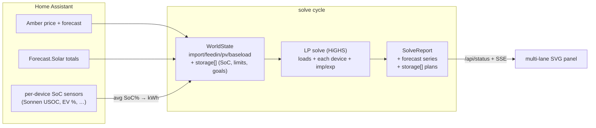
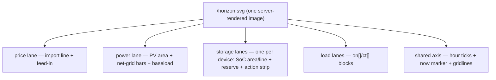

# Web panel redesign + storage modelling — "show me the plan"

**Status:** implemented · 2026-06-16
**Scope:** the add-on's solver and ingress web panel — `scheduler/src/lp.rs`,
`cycle.rs`, `config.rs`, `status.rs`, `web.rs`, `assets/index.html`.
**Behaviour envelope:** the scheduler stays **inert** — `dry_run: true`,
observe-only, **zero device commands**. Storage (home batteries, EVs, …) is fully
*modelled, planned, serialized, and visualised* as a configurable device list,
but never *commanded* (there are no storage control entities; live control is a
separate, deliberate cutover, out of scope here).

---

## 1. The problem (before)

The panel answered "is the scheduler alive and what did it decide *this second*?"
It did not answer the question a human actually has:

> *"What is going to run, when, and why — given where prices, solar, and the
> battery are heading over the next day?"*

The old panel showed header chips, a flat list of load *names*, per-load cards,
and a bare on/off SVG with no time axis, no price, no solar, no grid, no battery.
The single most valuable artefact the solver produces — **a 24-hour plan across
price, solar, grid, and storage** — was invisible.

## 2. What it shows now

One **unified timeline** stacks the lanes — price, power, one per storage device,
one per load — over a single shared time axis (`grid[]` timestamps), so a
vertical slice reads as *"cheap + sunny → charge / soak; expensive evening →
discharge."*

```
┌────────────────────────────────────────────────────────────────────────────┐
│  LP Scheduler         enabled · observing · dry-run · price · ☀ · house ·    │
│                       grid ▲/▼ · 🔋 SoC% · solve … ms            [Solve now]  │
├────────────────────────────────────────────────────────────────────────────┤
│  THE PLAN · next horizon                                                     │
│  price  ╭──╮            ╭─╮              ╭────╮      ← import (indigo)         │
│  $/kWh ─╯  ╰────────────╯ ╰──────────────╯    ╰───   ┄ feed-in (teal)         │
│  power  ▬▬▬░░░░          ╱▔▔▔╲ solar     ░░░▬▬▬       ▬ grid imp ▬ exp        │
│  kW    ━━━━━━━━━━━━━━━━━━━━━━━━━━━━━━━━━━━━━━━━━━━━━   baseload                │
│  sonnen    ╱▔▔▔▔▔▔▔▔▔▔▔▔▔▔▔▔▔▔╲   one lane per storage device (SoC area+line) │
│  3/14kWh ─ ─ ─ ─ ─ ─ ─ ─ ─ ─ ─ ─ ─ ─ ─ ─   reserve floor (dashed)            │
│          ▮▮▮charge▮▮▮          ▮▮discharge▮  action strip (green/amber)       │
│  ev    ╱▔▔▔▔▔▔▔▔▔▔▔▔ (charge-only EV, fills to target then holds)            │
│  hot_water     ▮▮▮                                                           │
│  dehumidifier                              ▮▮                                │
│  aircon                  ▮▮▮ (can-take)                                      │
│         00:00   03:00  06:00  09:00  12:00  15:00  18:00  21:00   ↑now        │
├────────────────────────────────────────────────────────────────────────────┤
│  LOADS (cards) … existing per-load reason / unmet / action cards             │
├────────────────────────────────────────────────────────────────────────────┤
│  DIAGNOSTICS   all good                                                      │
└────────────────────────────────────────────────────────────────────────────┘
```

Lanes degrade gracefully: a report missing a series simply omits that lane
(never draws a fake one); an unknown price step (`null`) is a *gap* in the line,
not a zero.

---

## 3. Data model (as built)

`SolveReport` gained grid-aligned forecast context plus a plan **per storage
device** (`scheduler/src/status.rs`). Storage is a *list* — parallel to `loads` —
so multiple home batteries, an EV, etc. each report independently. All series are
length `grid` except a device's SoC trajectory (`grid+1`, the value entering each
step plus the end state):

```rust
pub struct SolveReport {
    // ... existing scalar "now" fields + grid[] timestamps ...
    pub price:    Vec<Option<f64>>, // import $/kWh per step; null = unknown (a gap)
    pub feedin:   Vec<f64>,         // export $/kWh per step
    pub pv:       Vec<f64>,         // PV forecast, kW per step
    pub baseload: Vec<f64>,         // unmanaged consumption, kW per step
    pub grid_kw:  Vec<f64>,         // net grid, kW per step: +import / −export
    pub storage:  Vec<StorageReport>,
    pub loads:    Vec<LoadReport>,  // existing on[]/ct[] run windows
}

pub struct StorageReport {
    pub id: String,                 // "sonnen", "ev", …
    pub capacity_kwh: f64,
    pub min_soc_kwh: f64,
    pub max_soc_kwh: f64,
    pub soc_now_kwh: f64,
    pub soc_kwh: Vec<f64>,          // trajectory, len grid+1
    pub charge_kw: Vec<f64>,        // per step
    pub discharge_kw: Vec<f64>,     // per step
    pub action: String,             // "charging" | "discharging" | "idle" (now)
    pub target_unmet: f64,          // kWh short of this device's deadline goals
}
```

The forecast series are copies of values the cycle already held in `WorldState`
(no new HA reads); `grid_kw` and each device's plan are read back out of the
HiGHS solution. None of it changes a decision or issues a command.



---

## 4. The storage model (the MILP)

Each device is modelled independently and added to the existing two-stage
lexicographic solve (`scheduler/src/lp.rs`): continuous charge/discharge power +
an SoC boundary series, plus a binary charge/discharge mutex (only when the
device can do both). Every device's `ch`/`dis` feed the one **site balance**, so
they share the house, PV, and grid correctly. **Solved every cycle even when no
managed load has authority** — storage is a *site* resource, so the inert
deployment (all loads observe-only) still produces device plans and `grid_kw`.

Per device, per step `t`, with `dt_h` the step length and `eta = sqrt(round_trip)`:

| Element | Definition |
|---|---|
| `ch[t] ∈ [0, max_charge_kw]` | charge power (kW), 0 if unavailable this cycle |
| `dis[t] ∈ [0, max_discharge_kw]` | discharge power (kW); `max_discharge=0` ⇒ charge-only |
| `soc[t] ∈ [min_soc_kwh, max_soc_kwh]` | state of charge (kWh), `soc[0] = live read` |
| **SoC dynamics** | `soc[t+1] = soc[t] + ch[t]·eta·dt_h − dis[t]·dt_h/eta` |
| **Mutex** (if it can do both) | `ch[t] ≤ max_charge·mode[t]`, `dis[t] ≤ max_discharge·(1−mode[t])` |
| **Grid-charge policy** | if `!allow_grid_charge`: `ch[t] ≤ pv[t]` (solar-only) |
| **Site balance** | `imp[t] − exp[t] = managed[t] + baseload[t] − pv[t] + Σ_d(ch_d[t] − dis_d[t])` |
| **Export bound** | `exp[t] ≤ pv[t] + Σ_d dis_d[t]` (export only what you generate **or** discharge) |

Three correctness points that make the plan physical and presentable:

1. **The export bound had to change.** Previously `exp[t] ≤ pv[t]` ("can't
   export more than you generate" — which also kills meter-arbitrage
   unboundedness). With storage that can sell to grid the physically-correct
   bound is `exp[t] ≤ pv[t] + Σ dis[t]` — still arbitrage-free (no raw grid
   pass-through), but storage-to-grid export is now allowed. *(Test `b6`.)*
2. **Charge/discharge mutex.** An Amber price crossover (feed-in > import, real
   during negative-price events) otherwise baits *simultaneous* full charge
   **and** discharge to skim the spread — bounded but nonsensical to display.
   *(Test `b3`.)*
3. **Terminal SoC valuation — dischargeable devices only.** A finite horizon with
   no end-value dumps a battery to its floor at hour 24. We add a credit
   `− soc[n] · terminal_value` (`terminal_value = min(import over horizon)·eta`,
   floored at mean feed-in): low enough that real in-horizon arbitrage still
   wins, high enough to stop end-dumping. Under flat prices it cancels a step's
   discharge saving, so — with a tiny wear cost as tie-break — SoC holds flat.
   *(Test `b4`.)* A **charge-only** device (an EV) gets **no** terminal value —
   its energy leaves with the car — so it only charges to satisfy its goals.

### Composable goals (per device)

A home battery self-arbitrages with no goals (the grid-balance cost makes it
charge when `p_high/p_low > 1/eta²` and discharge into the peak — tests `b1`,
`b5`, `b7`). Beyond that, each device takes a **list of goals** that compose —
because people want different things at different times:

- **`target`** — reach `soc_pct` by the next occurrence of `ready_by`, as cheaply
  as possible. Encoded as a soft constraint `soc[deadline] + u ≥ want` with the
  slack `u` folded into Stage-1 `unmet` (so it's chased but never forced; an
  unreachable target is honestly reported, not broken). The deadline step is the
  first grid step at/after `ready_by` (DST-correct). *(Tests `b9`, `b10`, `b13`.)*
- **`price`** — opportunistically charge while import is below `below`, up to
  `up_to_soc_pct`. Encoded as a reward on stored energy (`− rs·below`,
  `rs ≤ soc[n]`, `rs ≤ cap`): the device charges whenever the step price sits
  under the ceiling, up to the cap. *(Test `b11`.)*

A charge-only device with **no** goals simply sits — charging it would be a pure
round-trip loss with no recovery. *(Test `b8`.)* Availability (e.g. an EV
plugged-in sensor) gates a device's power to zero for the cycle. *(Test `b13`.)*

The two-stage structure is unchanged: Stage 1 minimises must-have `unmet`
(load shortfall **and** storage target shortfall); Stage 2 freezes it and
minimises net site cost (inclusive of every device's effect on `imp`/`exp`, plus
wear, terminal valuation, and price-goal rewards).

---

## 5. Config — storage as a device list

A `global.storage` *list* (`scheduler/src/config.rs`), validated per device
(unique ids, sane ranges, parseable `ready_by`). Each device is resolved every
cycle by averaging its SoC sensors into kWh, reading any availability sensor, and
resolving each goal's live `ValueRef`s (`cycle.rs::build_storage`). The Sonnen
pack exposes `sensor.usoc_sonnen01/02` (%); an EV exposes its own SoC %.

```yaml
global:
  storage:
    - id: sonnen                 # home battery — self-arbitrages (no goals needed)
      soc_entities: [sensor.usoc_sonnen01, sensor.usoc_sonnen02]  # %, averaged
      capacity_kwh: 20.0
      max_charge_kw: 8.0
      max_discharge_kw: 8.0      # 0 = charge-only
      round_trip_efficiency: 0.9 # default 0.9
      reserve_soc_pct: 10        # plan floor; default 0
      max_soc_pct: 100           # default 100
      allow_grid_charge: true    # false = soak solar only; default true
    - id: ev                     # charge-only car, driven by its goals
      soc_entities: [sensor.ev_battery_level]
      capacity_kwh: 60.0
      max_charge_kw: 7.0
      max_discharge_kw: 0        # no V2G
      available_entity: binary_sensor.ev_plugged_in
      goals:
        - kind: target           # 80% by 07:00, as cheap as possible
          soc_pct: { value: 80 }
          ready_by: "07:00"
        - kind: price            # plus: top up whenever it's under $0.10
          below: { value: 0.10 }
          up_to_soc_pct: { value: 100 }
```

`soc_pct`, `below`, and `up_to_soc_pct` are `ValueRef`s — a literal **or** a live
HA entity — so targets and ceilings can be tuned from HA without editing YAML.

Each device exposes its own SoC sensor(s) (the Sonnens expose
`sensor.usoc_sonnen01/02`); capacity and power limits are config (the REST API
doesn't expose usable-kWh or rate caps cleanly). If a device's SoC can't be read
this cycle, that device is simply unmodelled for the cycle (a diagnostic is
logged) rather than guessed — the others still plan.

---

## 6. Rendering

The panel keeps its **zero-build, server-rendered SVG** ethos — no Chart.js, no
bundler. `web.rs::render_horizon` is a pure function of the report producing one
multi-lane SVG (`/horizon.svg`) — **one storage lane per device, labelled by
`id`** — refreshed atomically each solve and trivially screenshot-able by the
`$lp-setup` driver. Every drawn element carries a stable `class` (`price-import`,
`pv-area`, `grid-import`/`grid-export`, `soc-line`/`soc-area`/`soc-reserve`,
`batt-charge`/`batt-discharge`, `load-on`/`load-ct`, `now-line`, `tick`) so the
web tests assert structure, not pixels.



`index.html` gained grid and per-device storage (`id` · SoC · % · action, plus a
target shortfall if any) header chips, an "observing · dry-run" mode chip, and a
colour legend under the chart.

---

## 7. Test coverage (TDD)

All added before/with the implementation; `make test` (fmt + clippy + 119 tests)
is green.

- **Solver** (`tests/lp.rs`): `g1`/`g2` grid_kw import/export; `b1` charge-cheap/
  discharge-peak arbitrage; `b2` SoC bounds; `b3` mutex under a price crossover;
  `b4` flat-price no-dump/no-churn; `b5` grid-charge policy; `b6` discharge
  exports beyond PV; `b7` solar-only charging; `b8` charge-only device with no
  goals stays put; `b9` EV target met cheaply by deadline; `b10` honest unmet when
  unreachable; `b11` price-goal opportunistic charging up to a cap; `b12` two
  devices planned independently (battery arbitrages, EV charge-only); `b13`
  unavailable device idle + honest unmet.
- **Report** (`status.rs`): JSON contract incl. `null` price gaps + the storage
  device list.
- **Config** (`config.rs`): storage list parse, goals, defaults, range rejections,
  bad `ready_by`, duplicate ids.
- **Web** (`tests/web.rs`): `w4` graceful minimal render; `w6` every lane (incl. a
  storage lane labelled by `id`) renders for a full report.
- **End-to-end** (`tests/e2e.rs`): the real binary boots `example.yaml`, reads the
  Sonnen SoC from the stub, plans the storage device, serves the panel — and
  still **POSTs nothing** (inert).

---

## 8. Guarantees / non-goals

- **Inert.** No new HA reads beyond SoC / availability sensors, no service calls,
  no change to the executor. `dry_run: true`, observe-only. Storage is modelled
  and shown, never commanded.
- **No hard-coding.** Storage is a configurable list — N home batteries, EVs
  (charge-only or V2G), each with its own limits, grid-charge policy, availability
  sensor, and composable goals. Nothing is specific to one pack.
- **No fake data.** Unknown prices and absent series render as gaps / omitted
  lanes, never invented lines.
- **No new dependencies / build step.** Server-rendered SVG + one embedded HTML.

**Out of scope (future):** live storage *control* (the cutover — charge/discharge
service calls + authority), more goal kinds (backup reserve, demand-charge
shaving), a units toggle (¢ vs \$), and a horizon span toggle. The data and chart
already support per-device lanes and goals; control is deliberately deferred to
keep this change read-only and inert.
